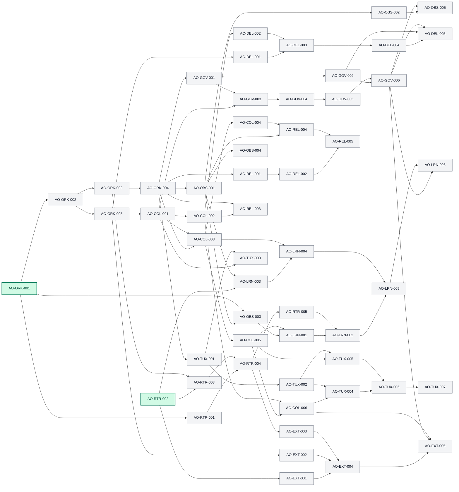
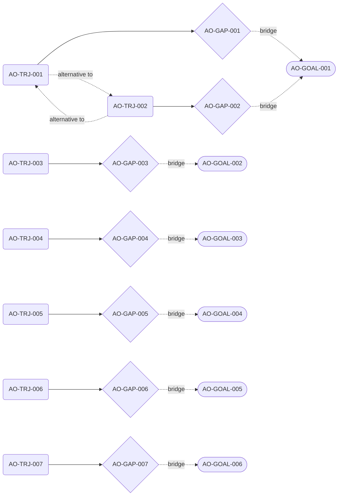
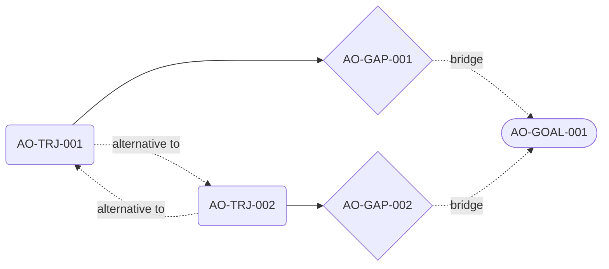
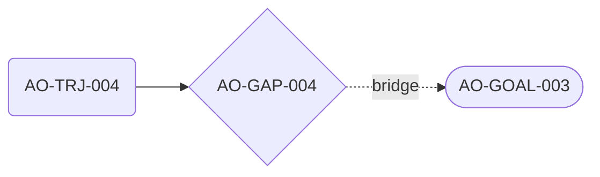
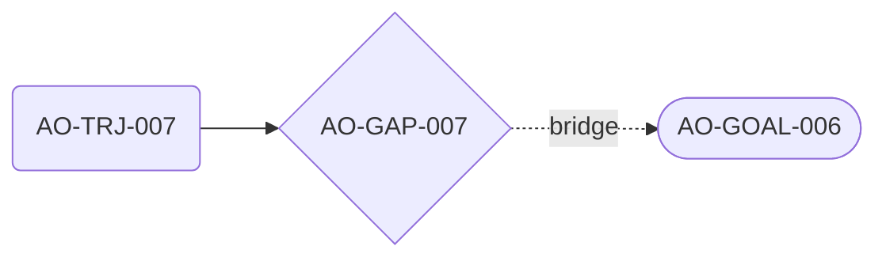

# Agent Orchestration Living Roadmap

This file is the durable, machine-readable capability graph for evolving Agent Orchestration from a local MCP/ACP broker into a provider-neutral, governed, inspectable orchestration platform. It is both a strategic map and an operating guide. Task records describe executable enhancements; unlock edges make readiness explicit; trajectories describe plausible multi-hop routes; gaps record missing capability or evidence; goals describe durable destinations.

## Operating contract

### Object semantics

- **Task** — an executable, independently verifiable enhancement. `status` describes delivery state; `readiness` is derived only from incoming hard `requires` edges. `independent: true` means that, once ready, the task can run as one isolated workstream without coordinated sibling changes; it does not mean the task is a dependency root. Existing implementation is recorded as `baseline`, never as a completed seed task.
- **Unlock** — a stable directed graph edge. The edge runs from prerequisite `from` to beneficiary `to`. `requires` is a hard readiness dependency. `enhances` records optional leverage. `bridge` connects a task to a distant goal through an explicit gap. Only `requires` participates in readiness.
- **Trajectory** — a plausible route to a capability at least two task-sized enhancements away. It records epistemic confidence separately from human approval and separately from materialization progress.
- **Gap** — a named missing capability, dependency, or body of evidence on a trajectory. Gap state changes only through an enhancement operation with inspectable output.
- **Goal** — a durable outcome, not executable work. A goal may have competing trajectories but exactly one preferred trajectory.

### Enhancement operations

1. **Refine task** — clarify one task's acceptance, seams, evidence, size, or hard dependencies without changing its strategic identity.
2. **Materialize unlock** — add a stable edge after proving the source task creates the stated capability. Hard `requires` edges must remain acyclic.
3. **Extend trajectory** — add evidence-backed tasks, unlocks, or an alternative route while preserving assumptions and disconfirming signals.
4. **Fill trajectory gap** — operate distance-aware: a one-hop gap materializes as a task plus its immediate capability edge; a gap still two or more hops away extends the trajectory with another task or child route. The operation updates `filledByIds`, hop estimate, and next gap without pretending the goal is attained.
5. **Advance goal** — update attainment evidence only after goal-level success measures pass. Completing a task or trajectory does not automatically attain a goal.
6. **Approve strategy** — strategic approval is human-only. Agents may propose or analyze trajectories and goals; they may not set `decisionState` to `approved`.

Strategic objects never execute tools, spend budget, reserve capacity, mutate workspaces, or authorize providers. Only an explicitly spawned task execution can do those things under the broker's existing permission and isolation rules.

### Status and validation rules

- Seed tasks use `status: "planned"`. Only `AO-ORK-001` and `AO-RTR-002` start `readiness: "ready"`; every other task is `gated` by at least one incoming hard `requires` edge.
- Baseline is one of `none`, `partial`, or `strong-foundation`. Baseline describes reusable implementation, not roadmap completion.
- Task IDs, unlock IDs, goal IDs, trajectory IDs, and gap IDs are immutable. Supersession creates a new same-kind record, preserves the old record, marks the old record's kind-specific lifecycle `superseded`, and sets its `supersededById` to the replacement. Supersession links cannot cross kinds or self-reference; every chain is acyclic and terminates at a live same-kind replacement. Retired historical records remain append-only and may preserve evidence and lineage, while connectedness, readiness, preferred-route, and other active projection constraints apply only to live records.
- Hard `requires` edges form a DAG. `enhances` and `bridge` edges are excluded from readiness calculations.
- Every goal has one preferred trajectory. Alternative routes use `alternativeTo`; they never silently replace the preferred route.
- Trajectory `hopEstimate.min` is at least 2. Goals and trajectories do not use percentage-complete; they expose materialized objects, open gaps, confidence, and verification.
- Capability keys are namespaced and stable. Similar additions must reuse an existing object, declare an alternative trajectory, or explicitly supersede it.
- With no target, an **eligible action** is either a planned task whose derived `readiness` is `ready`, or a roadmap-only refinement that does not claim execution readiness. List executable tasks first and label refinements explicitly.
- Allocate every new ID deterministically as the next unused numeric suffix within its kind and namespace. Never renumber, recycle, or fill an earlier hole; preserve superseded and rejected records.

## Task registry

### Orchestration Kernel — `AO-ORK-001..005`

```roadmap-task
[
  {"schemaVersion":1,"kind":"task","id":"AO-ORK-001","capabilityKey":"task.kernel.mission-aggregate","title":"Introduce the Mission aggregate and task graph","category":"Orchestration Kernel","status":"planned","readiness":"ready","baseline":"partial","independent":true,"helps":"Creates the durable ownership boundary used by every multi-agent goal.","why":"Runs exist, but no aggregate owns a mission, its tasks, team, shared policy, budgets, and child runs.","unlockIds":["AO-U-001","AO-U-005","AO-U-048"],"acceptance":["A versioned Mission schema owns task nodes, child run references, policy, budgets, and aggregate state.","Mission identity and repository authority are durable and repository-scoped.","Mission lifecycle tests cover creation, mutation invariants, and terminality."],"sourceSeams":[{"path":"src/state/store.mjs","anchor":"async createUnlocked("},{"path":"src/service.mjs","anchor":"async spawn("},{"path":"src/service.mjs","anchor":"async send("}],"evidence":["Run snapshots already aggregate input, plan, sessions, outputs, workspace, decision, and parentRunId."],"unlocks":"Declarative mission specs, semantic intent placement, and mission-level accounting."},
  {"schemaVersion":1,"kind":"task","id":"AO-ORK-002","capabilityKey":"task.kernel.declarative-specifications","title":"Define declarative Mission, Team, and Protocol specs","category":"Orchestration Kernel","status":"planned","readiness":"gated","baseline":"strong-foundation","independent":true,"helps":"Makes orchestration topology data-driven instead of protocol-ID special-cased.","why":"Protocol DAGs exist, but mission and team formation are not first-class and architecture planning remains hardcoded.","unlockIds":["AO-U-002","AO-U-004"],"acceptance":["Versioned MissionSpec, TeamSpec, ProtocolSpec, role, contract, and policy references validate deterministically.","Specs reject unknown executors, cycles, unresolved contracts, and incompatible versions.","Architecture behavior can be represented without a planner branch keyed to its protocol ID."],"sourceSeams":[{"path":"src/protocols/definitions.mjs","anchor":"export function validateProtocolDefinition"},{"path":"src/protocols/definitions.mjs","anchor":"export const PROTOCOL_DEFINITIONS"},{"path":"src/protocols/planner.mjs","anchor":"export function createExecutionPlan"}],"evidence":["Protocol definitions and topological validation are already declarative; architecture constraints are partly duplicated in planner code."],"unlocks":"Mission compilation and a provider-neutral primitive registry."},
  {"schemaVersion":1,"kind":"task","id":"AO-ORK-003","capabilityKey":"task.kernel.execution-lockfiles","title":"Compile missions into immutable execution lockfiles","category":"Orchestration Kernel","status":"planned","readiness":"gated","baseline":"strong-foundation","independent":false,"helps":"Turns mutable intent and policy into a replayable, inspectable execution commitment.","why":"Execution plans have stable IDs, but they do not lock team roles, bids, budgets, capability evidence, topology, or policy inputs as one artifact.","unlockIds":["AO-U-003","AO-U-007"],"acceptance":["The compiler emits a canonical lockfile with spec hashes, roles, routes, capabilities, budgets, fallbacks, and provenance.","The same frozen inputs produce the same lockfile ID.","Execution refuses unlocked or schema-incompatible plans."],"sourceSeams":[{"path":"src/protocols/planner.mjs","anchor":"export function createExecutionPlan"},{"path":"src/policy/router.mjs","anchor":"const decisionBody ="},{"path":"src/service.mjs","anchor":"plan: prepared.plan"}],"evidence":["Plan and route IDs already use canonical hashing and are persisted with each run."],"unlocks":"Mission execution projections and contract-net allocation."},
  {"schemaVersion":1,"kind":"task","id":"AO-ORK-004","capabilityKey":"task.kernel.mission-event-sourcing","title":"Lift event-sourced execution from runs to missions","category":"Orchestration Kernel","status":"planned","readiness":"gated","baseline":"strong-foundation","independent":false,"helps":"Provides one recoverable history for tasks, handoffs, topology, approvals, and child runs.","why":"Run journals are durable and hash chained, but a mission cannot yet project state across multiple runs and collaboration objects.","unlockIds":["AO-U-013","AO-U-026","AO-U-034","AO-U-045","AO-U-052","AO-U-055"],"acceptance":["Mission and run events share a versioned aggregate envelope with correlation and causation IDs.","Mission projections rebuild solely from journals and reconcile child-run streams.","Snapshots repair after interrupted writes without losing graph history."],"sourceSeams":[{"path":"src/state/store.mjs","anchor":"async get("},{"path":"src/state/store.mjs","anchor":"async transition("},{"path":"src/state/store.mjs","anchor":"async appendEventUnlocked("}],"evidence":["RunStore already fsyncs hash-chained NDJSON before atomically replacing snapshots."],"unlocks":"Blackboards, governance records, terminal event streams, telemetry, replay, and idempotent collaboration."},
  {"schemaVersion":1,"kind":"task","id":"AO-ORK-005","capabilityKey":"task.kernel.primitive-registry","title":"Create a composable orchestration primitive registry","category":"Orchestration Kernel","status":"planned","readiness":"gated","baseline":"partial","independent":true,"helps":"Lets new coordination patterns compose without editing the central engine loop.","why":"Four executor kinds exist, but executor dispatch and the architecture gate are hardcoded.","unlockIds":["AO-U-011","AO-U-019","AO-U-061"],"acceptance":["Executors register lifecycle, input/output contracts, capability needs, retry behavior, and compensation semantics.","Built-ins cover route, reuse, persistent session, gate, parallel, map, reduce, barrier, approval, and compensation.","Unknown or incompatible primitives fail before lockfile creation."],"sourceSeams":[{"path":"src/protocols/definitions.mjs","anchor":"export function validateProtocolDefinition"},{"path":"src/runtime/engine.mjs","anchor":"function planStages("},{"path":"src/runtime/engine.mjs","anchor":"No stage executor is registered for selection kind"}],"evidence":["The engine already normalizes stage kinds and validates missing executors, but dispatch is a fixed conditional path."],"unlocks":"Typed collaboration, delivery contracts, and protocol extension APIs."}
]
```

## Strategic capability graph

Goals, trajectories, and gaps are decision records layered above the executable task DAG. They never change task readiness. The seed goals and preferred routes below record the human-approved direction of this roadmap; future agents may propose changes, but only a human may approve a different strategic route.

### Goals

```roadmap-goal
[
  {"schemaVersion":1,"kind":"goal","id":"AO-GOAL-001","title":"Terminal mission control","capabilityKey":"goal.terminal-mission-control","decisionState":"approved","attainmentState":"planned","outcome":"An operator can understand, steer, pause, approve, recover, and compare multi-agent missions from one accessible local-first terminal surface.","scope":["Mission topology, tasks, agents, threads, artifacts, evidence, budgets, approvals, failures, and notifications.","Event-driven continuity across reconnects without granting the UI independent authority."],"successMeasures":["A fresh operator can run and recover a representative mission without reading raw state files.","Every visible state and command maps to a durable broker projection or authority-checked operation.","Keyboard, screen-reader, reconnect, and notification acceptance passes."],"nonGoals":["Replacing the broker with UI state.","Requiring a cloud control plane or a particular interaction protocol."],"horizon":{"minHops":16,"maxHops":20},"evidence":["The current MCP surface already exposes status, event, wait, cancel, cleanup, and message operations.","Mission projections, terminal host, and interaction components remain planned tasks."],"preferredTrajectoryId":"AO-TRJ-001","helps":"Daily operation and inspection of the orchestration framework.","why":"A framework becomes usable when its authority, state, evidence, and interventions are legible in one coherent operator loop.","unlocks":"A practical mission-control product surface and faster diagnosis of every later capability.","approvalProvenance":{"actorType":"human","actorId":"roadmap-owner","decidedAt":"2026-08-21","evidenceRef":"human-approved roadmap direction"}},
  {"schemaVersion":1,"kind":"goal","id":"AO-GOAL-002","title":"Provider-neutral orchestration fabric","capabilityKey":"goal.provider-neutral-fabric","decisionState":"approved","attainmentState":"planned","outcome":"Providers, protocols, primitives, contracts, policies, and learned formations can evolve through public versioned extension contracts instead of central-engine edits.","scope":["Provider SDK, protocol and primitive registries, policy strategy SPI, compatibility, migrations, trust, and replay identity.","Conformance across Claude, Codex, Grok, Kimi, and future ACP-compatible providers."],"successMeasures":["One external provider and one external protocol install without broker-engine source changes.","Lockfiles preserve extension identity sufficiently for replay and migration.","Compatibility, permission, trust, rollback, and deprecation checks fail safely."],"nonGoals":["Making all provider capabilities identical.","Loading arbitrary untrusted executable code without isolation or policy."],"horizon":{"minHops":12,"maxHops":15},"evidence":["Trusted descriptors, capability catalogs, ACP turns, and version constants create a partial extension boundary.","Registries, public conformance, unified compatibility, and migration lifecycle are absent."],"preferredTrajectoryId":"AO-TRJ-003","helps":"Long-lived portability and low-cost provider or protocol change.","why":"Stable contracts at the broker boundary prevent each new model or collaboration pattern from becoming an infrastructure migration.","unlocks":"A composable ecosystem of independently shipped orchestration capabilities.","approvalProvenance":{"actorType":"human","actorId":"roadmap-owner","decidedAt":"2026-08-21","evidenceRef":"human-approved roadmap direction"}},
  {"schemaVersion":1,"kind":"goal","id":"AO-GOAL-003","title":"Governed autonomous delivery","capabilityKey":"goal.governed-autonomous-delivery","decisionState":"approved","attainmentState":"planned","outcome":"A multi-agent mission can produce, verify, review, approve, publish, compensate, or safely refuse real work under explicit human authority.","scope":["Deliverable contracts, workspace leases, verification, review, return, compensation, approval, budgets, secrets, identity, and audit cases.","Representative read and write missions with bounded external effects."],"successMeasures":["A write mission reaches an accepted delivery with complete provenance and no implicit authority transfer.","Policy denial, stale evidence, failed verification, and interrupted effects produce safe explainable dispositions.","Human approvals remain scoped, revocable, attributable, and replayable."],"nonGoals":["Unbounded autonomous deployment.","Treating provider output as verification or approval."],"horizon":{"minHops":18,"maxHops":22},"evidence":["The broker already enforces repository scope, capability checks, cancellation, and some architecture approval.","Generic delivery, authority, effect, and compensation objects are not integrated."],"preferredTrajectoryId":"AO-TRJ-004","helps":"Safe end-to-end execution of consequential work.","why":"Orchestration has product value only when it can finish work without hiding who authorized, verified, or changed what.","unlocks":"Controlled autonomous software and operational delivery workflows.","approvalProvenance":{"actorType":"human","actorId":"roadmap-owner","decidedAt":"2026-08-21","evidenceRef":"human-approved roadmap direction"}},
  {"schemaVersion":1,"kind":"goal","id":"AO-GOAL-004","title":"Replay and time travel","capabilityKey":"goal.replay-time-travel","decisionState":"approved","attainmentState":"planned","outcome":"Operators can deterministically reconstruct, inspect, compare, fork, and resume a mission at any verified checkpoint without silently repeating effects.","scope":["Mission events, projections, lockfiles, sessions, messages, artifacts, topology, policy, authority, effects, checkpoints, forks, and divergence reports.","Forensic and chaos evidence that strengthens but does not gate the preferred route."],"successMeasures":["Projection hashes match across clean replay, process restart, and supported schema versions.","A fork declares effect handling and produces an attributable divergence report.","An operator can inspect the causal evidence behind state at a chosen sequence."],"nonGoals":["Rewinding external reality.","Re-executing uncontrolled provider or tool effects during state reconstruction."],"horizon":{"minHops":4,"maxHops":8},"evidence":["The run store already uses fsynced hash-chained events and atomic snapshots.","Mission-wide capture, effect receipts, semantic checkpoints, and fork policy remain incomplete."],"preferredTrajectoryId":"AO-TRJ-005","helps":"Debugging, recovery, audit, simulation, and safe experimentation.","why":"A durable agent framework must explain and reproduce how it reached a state, especially when providers and policies change.","unlocks":"Deterministic recovery, counterfactual inspection, and trustworthy learning datasets.","approvalProvenance":{"actorType":"human","actorId":"roadmap-owner","decidedAt":"2026-08-21","evidenceRef":"human-approved roadmap direction"}},
  {"schemaVersion":1,"kind":"goal","id":"AO-GOAL-005","title":"Self-improving routing and collaboration","capabilityKey":"goal.self-improving-orchestration","decisionState":"approved","attainmentState":"planned","outcome":"The framework learns better routes, team formations, skills, and protocols from evidence while keeping promotion human-approved, bounded, reversible, and contestable.","scope":["Outcome contracts, calibrated profiles, counterfactual logs, simulation, reusable pattern curation, champion/challenger experiments, promotion, rollback, and forgetting.","Routing and collaboration improvements under immutable hard policy."],"successMeasures":["A shadow candidate outperforms the live strategy on a declared evaluation set without violating policy or budget.","Promotion cites evidence and human approval; regression or drift can demote and roll back it.","Every influenced decision identifies the exact learned asset and version."],"nonGoals":["Online self-modification of broker authority.","Automatic promotion from provider self-evaluation or opaque reward scores."],"horizon":{"minHops":27,"maxHops":32},"evidence":["Versioned route decisions, capability states, provider probes, and durable outputs offer raw inputs.","Outcome, experimentation, calibration, and promotion governance are absent."],"preferredTrajectoryId":"AO-TRJ-006","helps":"Better quality, cost, latency, resilience, and team design over time.","why":"Learning should reduce orchestration toil without turning policy and production behavior into an unreviewable feedback loop.","unlocks":"Evidence-backed adaptation across providers and mission types.","approvalProvenance":{"actorType":"human","actorId":"roadmap-owner","decidedAt":"2026-08-21","evidenceRef":"human-approved roadmap direction"}},
  {"schemaVersion":1,"kind":"goal","id":"AO-GOAL-006","title":"Federated human-agent organization","capabilityKey":"goal.federated-human-agent-organization","decisionState":"approved","attainmentState":"planned","outcome":"Multiple human and agent organizational domains can delegate work, form temporary teams, preserve dissent, and exchange evidence without sharing hidden authority or infrastructure.","scope":["Organization and actor identity, delegated authority, domain policy, live topology, role leases, typed communication, portable evidence, refusal, revocation, and contestation.","Local-first collaboration across independently governed broker domains."],"successMeasures":["Two domains complete a delegated mission with explicit scope, identity, policy, evidence, and revocation boundaries.","Neither domain gains ambient access to the other's workspace, secrets, providers, or internal state.","Disagreement, denial, expiry, and audit remain intelligible across the boundary."],"nonGoals":["A global superuser or shared hidden memory.","Assuming common infrastructure, provider, UI, or organizational policy."],"horizon":{"minHops":25,"maxHops":30},"evidence":["Repository authority, parent-child runs, messages, and protocol roles offer partial identity and delegation seams.","Organization identity, federation contracts, portable trust, and cross-domain topology are not first-class."],"preferredTrajectoryId":"AO-TRJ-007","helps":"Scalable organizations of specialized humans, agents, and providers.","why":"Federation turns a single orchestration broker into an organizational substrate without centralizing every trust decision.","unlocks":"Cross-team and cross-installation mission networks with bounded sovereignty.","approvalProvenance":{"actorType":"human","actorId":"roadmap-owner","decidedAt":"2026-08-21","evidenceRef":"human-approved roadmap direction"}}
]
```

### Trajectories

```roadmap-trajectory
[
  {"schemaVersion":1,"kind":"trajectory","id":"AO-TRJ-001","goalId":"AO-GOAL-001","title":"Event projections to a local-first mission-control TUI","capabilityKey":"trajectory.terminal.event-tui","strategyKey":"event-tui","epistemicState":"supported","decisionState":"approved","materializationState":"materialized","entryTaskIds":["AO-ORK-001"],"taskIds":["AO-ORK-001","AO-ORK-002","AO-ORK-003","AO-ORK-004","AO-ORK-005","AO-COL-001","AO-COL-002","AO-COL-003","AO-COL-005","AO-COL-006","AO-TUX-001","AO-TUX-002","AO-TUX-004","AO-TUX-005","AO-TUX-006","AO-TUX-007"],"unlockIds":["AO-U-001","AO-U-002","AO-U-003","AO-U-004","AO-U-011","AO-U-012","AO-U-013","AO-U-014","AO-U-016","AO-U-017","AO-U-018","AO-U-034","AO-U-035","AO-U-038","AO-U-039","AO-U-040","AO-U-041","AO-U-042","AO-U-043","AO-U-044","AO-U-078"],"gapIds":["AO-GAP-001"],"alternativeTo":["AO-TRJ-002"],"assumptions":["Durable broker events can support responsive terminal projections without a separate UI protocol.","Local-first operation remains the default trust and availability boundary."],"disconfirmingSignals":["Projection latency cannot meet interaction needs without a second state authority.","Core interactions cannot be represented accessibly in the chosen terminal stack."],"confidence":0.86,"hopEstimate":{"min":16,"max":20},"nextGapId":"AO-GAP-001","helps":"Moves existing broker operations into a coherent operator loop.","why":"It preserves one authority model and builds the UI from the same replayable facts used by recovery and audit.","unlocks":"Preferred route to AO-GOAL-001.","approvalProvenance":{"actorType":"human","actorId":"roadmap-owner","decidedAt":"2026-08-21","evidenceRef":"human-approved roadmap direction"}},
  {"schemaVersion":1,"kind":"trajectory","id":"AO-TRJ-002","goalId":"AO-GOAL-001","title":"AG-UI-compatible threaded mission control","capabilityKey":"trajectory.terminal.ag-ui","strategyKey":"ag-ui-adapter","epistemicState":"hypothesis","decisionState":"proposed","materializationState":"unmaterialized","entryTaskIds":["AO-ORK-001"],"taskIds":["AO-ORK-001","AO-ORK-002","AO-ORK-003","AO-ORK-004","AO-ORK-005","AO-COL-001","AO-TUX-001","AO-TUX-003"],"unlockIds":["AO-U-001","AO-U-002","AO-U-003","AO-U-004","AO-U-011","AO-U-034","AO-U-036","AO-U-037","AO-U-079"],"gapIds":["AO-GAP-002"],"alternativeTo":["AO-TRJ-001"],"assumptions":["AG-UI can map typed broker threads and mission projections without becoming an authority source.","Protocol portability is worth the additional compatibility surface."],"disconfirmingSignals":["AG-UI requires cloud session semantics or ambient authority incompatible with local-first operation.","Parity demands provider-specific branches in mission control."],"confidence":0.46,"hopEstimate":{"min":8,"max":10},"nextGapId":"AO-GAP-002","helps":"Preserves an ecosystem-compatible alternative without committing infrastructure early.","why":"A named alternative lets evidence change the interaction layer later without destabilizing the mission kernel.","unlocks":"Alternative route to AO-GOAL-001 after human approval.","approvalProvenance":null},
  {"schemaVersion":1,"kind":"trajectory","id":"AO-TRJ-003","goalId":"AO-GOAL-002","title":"Public extension contracts with conformance and compatibility","capabilityKey":"trajectory.fabric.public-extension-contracts","strategyKey":"versioned-extension-spi","epistemicState":"supported","decisionState":"approved","materializationState":"materialized","entryTaskIds":["AO-ORK-001","AO-RTR-002"],"taskIds":["AO-ORK-001","AO-ORK-002","AO-ORK-003","AO-ORK-005","AO-RTR-001","AO-RTR-002","AO-RTR-003","AO-RTR-004","AO-EXT-001","AO-EXT-002","AO-EXT-003","AO-EXT-004"],"unlockIds":["AO-U-001","AO-U-002","AO-U-004","AO-U-005","AO-U-006","AO-U-007","AO-U-008","AO-U-009","AO-U-060","AO-U-061","AO-U-062","AO-U-063","AO-U-064","AO-U-065","AO-U-080"],"gapIds":["AO-GAP-003"],"alternativeTo":[],"assumptions":["ACP remains a useful provider transport boundary while broker contracts own orchestration semantics.","First-party implementations can be migrated to the same public SPI used externally."],"disconfirmingSignals":["A required provider capability cannot be expressed without leaking provider internals into the kernel.","Replay cannot retain an extension's executable or semantic identity across upgrades."],"confidence":0.8,"hopEstimate":{"min":12,"max":15},"nextGapId":"AO-GAP-003","helps":"Separates provider and pattern growth from broker-engine releases.","why":"Conformance plus compatibility makes extensibility an architectural contract rather than a directory convention.","unlocks":"Preferred route to AO-GOAL-002.","approvalProvenance":{"actorType":"human","actorId":"roadmap-owner","decidedAt":"2026-08-21","evidenceRef":"human-approved roadmap direction"}},
  {"schemaVersion":1,"kind":"trajectory","id":"AO-TRJ-004","goalId":"AO-GOAL-003","title":"Contracted delivery under generic authority and compensation","capabilityKey":"trajectory.delivery.governed-effects","strategyKey":"contract-gate-compensate","epistemicState":"supported","decisionState":"approved","materializationState":"materialized","entryTaskIds":["AO-ORK-001"],"taskIds":["AO-ORK-001","AO-ORK-002","AO-ORK-003","AO-ORK-004","AO-ORK-005","AO-COL-001","AO-COL-002","AO-DEL-001","AO-DEL-002","AO-DEL-003","AO-DEL-004","AO-DEL-005","AO-GOV-001","AO-GOV-002","AO-GOV-003","AO-GOV-004","AO-GOV-005","AO-GOV-006"],"unlockIds":["AO-U-001","AO-U-002","AO-U-003","AO-U-004","AO-U-011","AO-U-012","AO-U-019","AO-U-020","AO-U-021","AO-U-022","AO-U-023","AO-U-024","AO-U-025","AO-U-026","AO-U-027","AO-U-028","AO-U-029","AO-U-030","AO-U-031","AO-U-032","AO-U-033","AO-U-081","AO-U-093"],"gapIds":["AO-GAP-004"],"alternativeTo":[],"assumptions":["Consequential work can be decomposed into typed deliverables, verifiers, authority checks, and compensable effects.","Human approval remains available at irreversible or policy-defined boundaries."],"disconfirmingSignals":["Representative deliveries require ambient credentials or workspace ownership not expressible as leases.","Compensation semantics cannot bound common interrupted external effects."],"confidence":0.78,"hopEstimate":{"min":18,"max":22},"nextGapId":"AO-GAP-004","helps":"Composes existing isolation and cancellation foundations into safe completion semantics.","why":"Delivery needs one evidence and authority chain from task assignment through final disposition.","unlocks":"Preferred route to AO-GOAL-003.","approvalProvenance":{"actorType":"human","actorId":"roadmap-owner","decidedAt":"2026-08-21","evidenceRef":"human-approved roadmap direction"}},
  {"schemaVersion":1,"kind":"trajectory","id":"AO-TRJ-005","goalId":"AO-GOAL-004","title":"Mission event replay through semantic checkpoints and forks","capabilityKey":"trajectory.replay.semantic-checkpoints","strategyKey":"event-checkpoint-fork","epistemicState":"supported","decisionState":"approved","materializationState":"materialized","entryTaskIds":["AO-ORK-001"],"taskIds":["AO-ORK-001","AO-ORK-002","AO-ORK-003","AO-ORK-004","AO-REL-001","AO-REL-002"],"unlockIds":["AO-U-001","AO-U-002","AO-U-003","AO-U-052","AO-U-053","AO-U-082"],"gapIds":["AO-GAP-005"],"alternativeTo":[],"assumptions":["Mission journals can capture every authoritative state transition while external effects are represented by receipts.","Replay can substitute recorded provider results unless an explicitly authorized fork requests new execution."],"disconfirmingSignals":["Important state remains reconstructable only from mutable workspace or provider sessions.","Schema evolution cannot reproduce old projection meaning."],"confidence":0.88,"hopEstimate":{"min":6,"max":8},"nextGapId":"AO-GAP-005","helps":"Extends the current hash-chained run journal into mission-level recovery and inspection.","why":"Semantic checkpoints distinguish safe state reconstruction from uncontrolled re-execution.","unlocks":"Preferred route to AO-GOAL-004.","approvalProvenance":{"actorType":"human","actorId":"roadmap-owner","decidedAt":"2026-08-21","evidenceRef":"human-approved roadmap direction"}},
  {"schemaVersion":1,"kind":"trajectory","id":"AO-TRJ-006","goalId":"AO-GOAL-005","title":"Observe, simulate, experiment, and human-promote","capabilityKey":"trajectory.learning.governed-loop","strategyKey":"shadow-evaluate-promote","epistemicState":"supported","decisionState":"approved","materializationState":"materialized","entryTaskIds":["AO-ORK-001","AO-RTR-002"],"taskIds":["AO-ORK-001","AO-ORK-002","AO-ORK-003","AO-ORK-004","AO-ORK-005","AO-RTR-001","AO-RTR-002","AO-RTR-003","AO-RTR-004","AO-RTR-005","AO-COL-001","AO-COL-003","AO-COL-005","AO-GOV-001","AO-GOV-002","AO-GOV-003","AO-GOV-004","AO-GOV-005","AO-GOV-006","AO-OBS-001","AO-OBS-003","AO-LRN-001","AO-LRN-002","AO-LRN-003","AO-LRN-004","AO-LRN-005","AO-LRN-006"],"unlockIds":["AO-U-001","AO-U-002","AO-U-003","AO-U-004","AO-U-005","AO-U-006","AO-U-007","AO-U-008","AO-U-009","AO-U-010","AO-U-011","AO-U-013","AO-U-014","AO-U-016","AO-U-026","AO-U-027","AO-U-028","AO-U-029","AO-U-030","AO-U-031","AO-U-032","AO-U-033","AO-U-045","AO-U-047","AO-U-048","AO-U-066","AO-U-067","AO-U-068","AO-U-069","AO-U-070","AO-U-071","AO-U-072","AO-U-073","AO-U-074","AO-U-075","AO-U-076","AO-U-077","AO-U-083"],"gapIds":["AO-GAP-006"],"alternativeTo":[],"assumptions":["Outcome and counterfactual evidence can distinguish useful adaptation from selection bias.","Shadow evaluation and bounded experiments provide enough evidence for human promotion decisions."],"disconfirmingSignals":["Outcome measures remain dominated by provider self-report or delayed external factors.","Candidate strategies cannot be replayed across stable evaluation segments."],"confidence":0.7,"hopEstimate":{"min":27,"max":32},"nextGapId":"AO-GAP-006","helps":"Creates a safe learning loop without granting learned code policy authority.","why":"Separation of observation, experimentation, and promotion keeps improvement inspectable and reversible.","unlocks":"Preferred route to AO-GOAL-005.","approvalProvenance":{"actorType":"human","actorId":"roadmap-owner","decidedAt":"2026-08-21","evidenceRef":"human-approved roadmap direction"}},
  {"schemaVersion":1,"kind":"trajectory","id":"AO-TRJ-007","goalId":"AO-GOAL-006","title":"Federate typed delegation through bounded organizational authority","capabilityKey":"trajectory.federation.bounded-delegation","strategyKey":"domain-contract-federation","epistemicState":"hypothesis","decisionState":"approved","materializationState":"unmaterialized","entryTaskIds":["AO-ORK-001","AO-RTR-002"],"taskIds":["AO-ORK-001","AO-ORK-002","AO-ORK-003","AO-ORK-004","AO-ORK-005","AO-RTR-001","AO-RTR-002","AO-RTR-003","AO-RTR-004","AO-COL-001","AO-COL-002","AO-COL-003","AO-COL-005","AO-COL-006","AO-GOV-001","AO-GOV-002","AO-GOV-003","AO-GOV-004","AO-GOV-005","AO-GOV-006","AO-EXT-001","AO-EXT-002","AO-EXT-003","AO-EXT-004","AO-EXT-005"],"unlockIds":["AO-U-001","AO-U-002","AO-U-003","AO-U-004","AO-U-005","AO-U-006","AO-U-007","AO-U-008","AO-U-009","AO-U-011","AO-U-012","AO-U-013","AO-U-014","AO-U-016","AO-U-017","AO-U-018","AO-U-026","AO-U-027","AO-U-028","AO-U-029","AO-U-030","AO-U-031","AO-U-032","AO-U-033","AO-U-060","AO-U-061","AO-U-062","AO-U-063","AO-U-064","AO-U-065","AO-U-084","AO-U-094","AO-U-095","AO-U-096"],"gapIds":["AO-GAP-007"],"alternativeTo":[],"assumptions":["Organization domains can exchange typed delegation and evidence without sharing broker internals.","Portable identity and authority claims can remain locally verified and revocable."],"disconfirmingSignals":["Cross-domain tasks require hidden shared state or a global superuser.","Revocation and refusal cannot be made consistent under partitions."],"confidence":0.58,"hopEstimate":{"min":25,"max":30},"nextGapId":"AO-GAP-007","helps":"Makes organization scale an extension of bounded broker contracts rather than a centralized rewrite.","why":"Federation preserves domain sovereignty while enabling richer temporary human-agent teams.","unlocks":"Preferred route to AO-GOAL-006.","approvalProvenance":{"actorType":"human","actorId":"roadmap-owner","decidedAt":"2026-08-21","evidenceRef":"human-approved roadmap direction"}}
]
```

### Trajectory gaps

Gap records use `recordType: "gap"`; their required `kind` field classifies the gap as `capability`, `dependency`, or `evidence`.

```roadmap-gap
[
  {"schemaVersion":1,"recordType":"gap","kind":"capability","id":"AO-GAP-001","capabilityKey":"gap.terminal.mission-control-loop","trajectoryId":"AO-TRJ-001","state":"partially-filled","fromAnchorIds":["AO-ORK-004","AO-COL-006"],"missingCapability":"A reconnect-safe live mission projection and complete accessible terminal interaction loop do not yet exist.","exitCriterion":"AO-TUX-001, AO-TUX-002, AO-TUX-004, AO-TUX-006, and AO-TUX-007 pass together against one resumed mission, with every command broker-authorized and every view event-derived.","hopEstimate":{"min":5,"max":8},"filledByIds":["AO-TUX-001","AO-TUX-002","AO-TUX-004","AO-TUX-006","AO-TUX-007"],"helps":"Turns backend orchestration state into daily mission control.","why":"The preferred route is architecturally supported but its operator loop remains unbuilt.","unlocks":"AO-U-078 and preferred attainment evidence for AO-GOAL-001.","evidence":["Existing broker operations expose resumable event sequences and authority-checked commands.","AO-TUX-001..007 are planned and none is done; the complete operator loop remains unverified."]},
  {"schemaVersion":1,"recordType":"gap","kind":"evidence","id":"AO-GAP-002","capabilityKey":"gap.terminal.ag-ui-evidence","trajectoryId":"AO-TRJ-002","state":"open","fromAnchorIds":["AO-COL-001","AO-TUX-001","AO-TUX-003"],"missingCapability":"AG-UI compatibility, projection mapping, feature parity, and local-first authority behavior are not demonstrated.","exitCriterion":"A disposable adapter prototype passes parity, reconnect, accessibility, repository-scope, denial, and threat-model review; a human then approves or rejects AO-TRJ-002.","hopEstimate":{"min":3,"max":6},"filledByIds":[],"helps":"Keeps a credible alternative interaction route available without premature adoption.","why":"Protocol compatibility is valuable only if it preserves the broker's authority and operating model.","unlocks":"Evidence for a human decision on AO-TRJ-002 and, if approved, AO-U-079.","evidence":["Typed messages and protocol registries provide candidate AG-UI mapping seams.","No AG-UI adapter, parity fixture, or threat-model result currently exists."]},
  {"schemaVersion":1,"recordType":"gap","kind":"capability","id":"AO-GAP-003","capabilityKey":"gap.fabric.extension-platform","trajectoryId":"AO-TRJ-003","state":"partially-filled","fromAnchorIds":["AO-RTR-002","AO-ORK-005"],"missingCapability":"Public provider, protocol, primitive, policy, compatibility, migration, and trust contracts are incomplete as one extension platform.","exitCriterion":"An independently built provider and protocol pass conformance, execute through public APIs, survive compatible upgrade, reject incompatible upgrade, replay by locked identity, and roll back without broker-engine edits.","hopEstimate":{"min":4,"max":7},"filledByIds":["AO-EXT-001","AO-EXT-002","AO-EXT-003","AO-EXT-004"],"helps":"Converts current internal seams into a durable provider-neutral fabric.","why":"A collection of adapters is not an extension framework until third parties can depend on stable contracts.","unlocks":"AO-U-080 and preferred attainment evidence for AO-GOAL-002.","evidence":["Provider descriptors, ACP turns, protocol definitions, and version constants provide partial public boundaries.","No external provider-plus-protocol fixture has passed conformance, migration, replay, and rollback."]},
  {"schemaVersion":1,"recordType":"gap","kind":"dependency","id":"AO-GAP-004","capabilityKey":"gap.delivery.end-to-end-governance","trajectoryId":"AO-TRJ-004","state":"partially-filled","fromAnchorIds":["AO-ORK-004","AO-COL-002","AO-GOV-001"],"missingCapability":"Delivery contracts, workspace ownership, verification, review, return, approval, budget, effect, compensation, identity, and audit semantics are not composed end to end.","exitCriterion":"A representative write mission passes accepted, denied, stale-evidence, failed-verification, interrupted-effect, compensation, and revocation scenarios with a complete causal case bundle.","hopEstimate":{"min":8,"max":14},"filledByIds":["AO-DEL-001","AO-DEL-002","AO-DEL-003","AO-DEL-004","AO-DEL-005","AO-GOV-001","AO-GOV-002","AO-GOV-003","AO-GOV-004","AO-GOV-005","AO-GOV-006"],"helps":"Creates one governed delivery state machine instead of scattered safeguards.","why":"Each individual control can pass while authority or effects still fall through the boundaries between them.","unlocks":"AO-U-081 and preferred attainment evidence for AO-GOAL-003.","evidence":["Repository isolation, architecture approval, cancellation, and durable events provide partial governed-delivery controls.","No representative write mission has passed the complete delivery, compensation, revocation, and contestability scenario matrix."]},
  {"schemaVersion":1,"recordType":"gap","kind":"capability","id":"AO-GAP-005","capabilityKey":"gap.replay.complete-effect-history","trajectoryId":"AO-TRJ-005","state":"partially-filled","fromAnchorIds":["AO-ORK-004"],"missingCapability":"Mission events do not yet fully capture effect receipts, artifacts, provider sessions, policies, topology, semantic checkpoints, and fork behavior.","exitCriterion":"Clean replay, restart replay, and a declared fork produce verified projection hashes and an explainable divergence report without repeating uncontrolled effects.","hopEstimate":{"min":2,"max":5},"filledByIds":["AO-REL-001","AO-REL-002"],"helps":"Makes durable history usable for recovery, inspection, and safe time travel.","why":"Hash chaining proves event order but not completeness or safe replay semantics.","unlocks":"AO-U-082 and preferred attainment evidence for AO-GOAL-004.","evidence":["Hash-chained run events and deterministic plan and route IDs provide a replay foundation.","Mission-wide effect, artifact, session, topology, and fork fidelity has not been demonstrated."]},
  {"schemaVersion":1,"recordType":"gap","kind":"evidence","id":"AO-GAP-006","capabilityKey":"gap.learning.governed-evidence-loop","trajectoryId":"AO-TRJ-006","state":"partially-filled","fromAnchorIds":["AO-RTR-002","AO-OBS-001","AO-COL-003"],"missingCapability":"The framework lacks calibrated outcome evidence, counterfactual evaluation, bounded experiments, and governed promotion sufficient to trust learned behavior.","exitCriterion":"One versioned shadow candidate improves a declared quality, cost, latency, or collaboration outcome on held-out missions, passes policy and segment checks, receives human promotion, and proves rollback under induced drift.","hopEstimate":{"min":7,"max":12},"filledByIds":["AO-LRN-001","AO-LRN-002","AO-LRN-003","AO-LRN-004","AO-LRN-005","AO-LRN-006"],"helps":"Closes the learning loop while separating recommendation from authority.","why":"Observed correlation and provider self-ratings are not adequate grounds for changing production orchestration.","unlocks":"AO-U-083 and preferred attainment evidence for AO-GOAL-005.","evidence":["Versioned routing decisions, capability probes, and attributed outputs provide raw learning inputs.","No held-out evaluation, bounded experiment, human promotion, drift demotion, and rollback chain has passed end to end."]},
  {"schemaVersion":1,"recordType":"gap","kind":"capability","id":"AO-GAP-007","capabilityKey":"gap.federation.cross-domain-contracts","trajectoryId":"AO-TRJ-007","state":"partially-filled","fromAnchorIds":["AO-EXT-004","AO-GOV-006","AO-COL-006"],"missingCapability":"Organization identity, boundary policy, delegated authority, cross-domain topology, portable evidence, refusal, revocation, and contestation are not first-class federation contracts.","exitCriterion":"Two independently governed domains complete and audit a delegated mission while proving least authority, scoped evidence exchange, refusal, expiry, revocation, and partition recovery.","hopEstimate":{"min":2,"max":3},"filledByIds":["AO-EXT-005"],"helps":"Extends the local broker into an organizational substrate without centralizing trust.","why":"Cross-domain orchestration fails safely only when sovereignty and delegation are explicit data.","unlocks":"AO-U-084 and preferred attainment evidence for AO-GOAL-006.","evidence":["Typed messages, delegation passports, topology versions, compliance cases, and extension trust provide prerequisite contracts.","No two-domain federation fixture has proven trust-root exchange, remote delegation, portable evidence, revocation, or partition recovery."]}
]
```

## Unlock graph

The following edge registry is authoritative. For a `requires` edge, `to` is gated until `from` is complete and the edge verification passes. `enhances` and `bridge` explain strategic leverage but never affect task readiness.

```roadmap-unlock
[
  {"schemaVersion":1,"kind":"unlock","id":"AO-U-001","from":"AO-ORK-001","to":"AO-ORK-002","relation":"requires","capabilityKey":"kernel.mission-aggregate","rationale":"Declarative specs require a stable aggregate that owns their lifecycle.","verification":"Mission schema and lifecycle acceptance for AO-ORK-001 pass.","helps":"Orchestration Kernel","why":"Specs need a durable owner before they can be compiled or executed.","unlocks":"AO-ORK-002 readiness."},
  {"schemaVersion":1,"kind":"unlock","id":"AO-U-002","from":"AO-ORK-002","to":"AO-ORK-003","relation":"requires","capabilityKey":"kernel.declarative-specs","rationale":"The compiler needs validated Mission, Team, and Protocol inputs.","verification":"AO-ORK-002 schemas reject invalid graphs and version conflicts.","helps":"Mission compilation","why":"Compilation cannot freeze an undefined contract.","unlocks":"AO-ORK-003 readiness."},
  {"schemaVersion":1,"kind":"unlock","id":"AO-U-003","from":"AO-ORK-003","to":"AO-ORK-004","relation":"requires","capabilityKey":"kernel.execution-lockfile","rationale":"Mission execution must project a frozen plan rather than mutable intent.","verification":"AO-ORK-003 lockfile is canonical, persisted, and execution-enforced.","helps":"Mission event sourcing","why":"Events need one immutable execution commitment to reference.","unlocks":"AO-ORK-004 readiness."},
  {"schemaVersion":1,"kind":"unlock","id":"AO-U-004","from":"AO-ORK-002","to":"AO-ORK-005","relation":"requires","capabilityKey":"kernel.primitive-contracts","rationale":"Primitive registration depends on typed declarative lifecycle and contract schemas.","verification":"AO-ORK-002 exposes validated primitive references and output contracts.","helps":"Composable primitives","why":"A registry without declarative contracts would move hardcoding rather than remove it.","unlocks":"AO-ORK-005 readiness."},
  {"schemaVersion":1,"kind":"unlock","id":"AO-U-005","from":"AO-ORK-001","to":"AO-RTR-001","relation":"requires","capabilityKey":"routing.mission-intent-anchor","rationale":"Semantic classification needs a mission object to own ambiguity, evidence, and operator override.","verification":"AO-ORK-001 persists mission intent evidence and revisions.","helps":"Semantic intent","why":"Classification must attach to a durable decision subject.","unlocks":"AO-RTR-001 readiness."},
  {"schemaVersion":1,"kind":"unlock","id":"AO-U-006","from":"AO-RTR-002","to":"AO-RTR-003","relation":"requires","capabilityKey":"routing.bid-eligibility","rationale":"Only providers with qualified capability cards may bid.","verification":"AO-RTR-002 cards expose current, provenance-rich eligibility.","helps":"Contract-net bidding","why":"Bidding before qualification would optimize unverified claims.","unlocks":"One hard prerequisite for AO-RTR-003."},
  {"schemaVersion":1,"kind":"unlock","id":"AO-U-007","from":"AO-ORK-003","to":"AO-RTR-003","relation":"requires","capabilityKey":"routing.bid-lockfile","rationale":"Bids and their selection must be frozen into the mission lockfile.","verification":"AO-ORK-003 lockfile records candidate, bid, expiry, and rationale data.","helps":"Contract-net bidding","why":"Market allocation must remain replayable.","unlocks":"Final hard prerequisite for AO-RTR-003."},
  {"schemaVersion":1,"kind":"unlock","id":"AO-U-008","from":"AO-RTR-001","to":"AO-RTR-004","relation":"requires","capabilityKey":"routing.semantic-portfolio-input","rationale":"Portfolios need normalized intent, capability, risk, and ambiguity inputs.","verification":"AO-RTR-001 classification contract is stable and overrideable.","helps":"Strategy portfolios","why":"Strategies cannot be compared against unstructured task text.","unlocks":"One hard prerequisite for AO-RTR-004."},
  {"schemaVersion":1,"kind":"unlock","id":"AO-U-009","from":"AO-RTR-003","to":"AO-RTR-004","relation":"requires","capabilityKey":"routing.market-strategy","rationale":"Portfolios must be able to select and configure the bidding strategy.","verification":"AO-RTR-003 produces bounded, attributed, lockable bids.","helps":"Strategy portfolios","why":"Contract-net allocation belongs inside the explicit strategy layer.","unlocks":"Final hard prerequisite for AO-RTR-004."},
  {"schemaVersion":1,"kind":"unlock","id":"AO-U-010","from":"AO-RTR-004","to":"AO-RTR-005","relation":"requires","capabilityKey":"routing.learnable-portfolio","rationale":"Learning requires stable strategy boundaries, outcomes, and hard constraints.","verification":"AO-RTR-004 portfolio versions and explanations are replayable.","helps":"Learned routing","why":"A learned scorer must not invent or weaken policy.","unlocks":"AO-RTR-005 readiness."},
  {"schemaVersion":1,"kind":"unlock","id":"AO-U-011","from":"AO-ORK-005","to":"AO-COL-001","relation":"requires","capabilityKey":"collaboration.message-primitive","rationale":"Typed messaging needs a registered broker primitive and contract lifecycle.","verification":"AO-ORK-005 can register a durable message primitive with validation.","helps":"Typed messages","why":"Messages must be orchestration objects, not prompt conventions.","unlocks":"AO-COL-001 readiness."},
  {"schemaVersion":1,"kind":"unlock","id":"AO-U-012","from":"AO-COL-001","to":"AO-COL-002","relation":"requires","capabilityKey":"collaboration.handoff-messages","rationale":"Offers, accepts, rejects, and acknowledgements require typed delivery semantics.","verification":"AO-COL-001 messages support identity, correlation, and delivery state.","helps":"Two-phase handoffs","why":"Ownership cannot transfer through ambiguous text.","unlocks":"AO-COL-002 readiness."},
  {"schemaVersion":1,"kind":"unlock","id":"AO-U-013","from":"AO-ORK-004","to":"AO-COL-003","relation":"requires","capabilityKey":"collaboration.blackboard-journal","rationale":"The blackboard must be reconstructable from mission events.","verification":"AO-ORK-004 mission journal supports append-only collaboration events.","helps":"Provenance blackboard","why":"Shared memory without durable causality is unsafe and uninspectable.","unlocks":"One hard prerequisite for AO-COL-003."},
  {"schemaVersion":1,"kind":"unlock","id":"AO-U-014","from":"AO-COL-001","to":"AO-COL-003","relation":"requires","capabilityKey":"collaboration.blackboard-envelope","rationale":"Blackboard entries reuse typed authorship, payload, and visibility contracts.","verification":"AO-COL-001 schema registry validates blackboard message types.","helps":"Provenance blackboard","why":"The blackboard should not create a second communication protocol.","unlocks":"Final hard prerequisite for AO-COL-003."},
  {"schemaVersion":1,"kind":"unlock","id":"AO-U-015","from":"AO-COL-003","to":"AO-COL-004","relation":"requires","capabilityKey":"collaboration.signal-surface","rationale":"Stigmergic coordination requires a durable environment on which to leave signals.","verification":"AO-COL-003 supports scoped signal entries and subscriptions.","helps":"Stigmergy","why":"Signals need provenance, TTL, and shared visibility.","unlocks":"AO-COL-004 readiness."},
  {"schemaVersion":1,"kind":"unlock","id":"AO-U-016","from":"AO-COL-003","to":"AO-COL-005","relation":"requires","capabilityKey":"collaboration.evidence-nodes","rationale":"General dissent graphs need durable claim and evidence nodes.","verification":"AO-COL-003 persists attributable claims, evidence, retractions, and dependencies.","helps":"Dissent and evidence","why":"Disagreement cannot be preserved as raw transcript alone.","unlocks":"AO-COL-005 readiness."},
  {"schemaVersion":1,"kind":"unlock","id":"AO-U-017","from":"AO-COL-005","to":"AO-COL-006","relation":"requires","capabilityKey":"collaboration.topology-dissent","rationale":"Live pods need a way to preserve and route unresolved disagreement.","verification":"AO-COL-005 exposes severity, disposition, and unresolved evidence to scheduling.","helps":"Live pods","why":"Self-organizing teams must not optimize dissent away.","unlocks":"One hard prerequisite for AO-COL-006."},
  {"schemaVersion":1,"kind":"unlock","id":"AO-U-018","from":"AO-COL-002","to":"AO-COL-006","relation":"requires","capabilityKey":"collaboration.role-leases","rationale":"Pod membership and temporary roles require explicit leases and handoffs.","verification":"AO-COL-002 supports bounded role ownership transfer.","helps":"Live pods","why":"Topology changes require accountable ownership boundaries.","unlocks":"Final hard prerequisite for AO-COL-006."},
  {"schemaVersion":1,"kind":"unlock","id":"AO-U-019","from":"AO-ORK-005","to":"AO-DEL-001","relation":"requires","capabilityKey":"delivery.contract-primitive","rationale":"Deliverables and acceptance must be registered typed primitives.","verification":"AO-ORK-005 registry loads versioned deliverable validators.","helps":"Deliverable contracts","why":"Acceptance must execute through broker-owned contracts.","unlocks":"AO-DEL-001 readiness."},
  {"schemaVersion":1,"kind":"unlock","id":"AO-U-020","from":"AO-COL-002","to":"AO-DEL-002","relation":"requires","capabilityKey":"delivery.workspace-handoff","rationale":"Workspace ownership transfer needs two-phase lease semantics.","verification":"AO-COL-002 handoffs carry scope, authority, expiry, and acknowledgement.","helps":"Workspace leases","why":"Writable state must never move through an implicit follow-up.","unlocks":"AO-DEL-002 readiness."},
  {"schemaVersion":1,"kind":"unlock","id":"AO-U-021","from":"AO-DEL-001","to":"AO-DEL-003","relation":"requires","capabilityKey":"delivery.verifiable-output","rationale":"Verification pipelines need deterministic deliverable contracts.","verification":"AO-DEL-001 validators produce pass, fail, evidence, and artifact identity.","helps":"Delivery pipelines","why":"Review cannot gate an undefined completion claim.","unlocks":"One hard prerequisite for AO-DEL-003."},
  {"schemaVersion":1,"kind":"unlock","id":"AO-U-022","from":"AO-DEL-002","to":"AO-DEL-003","relation":"requires","capabilityKey":"delivery.leased-workspace","rationale":"Multi-agent verification must inspect a broker-owned stable workspace.","verification":"AO-DEL-002 leases preserve ownership and Git metadata through review.","helps":"Delivery pipelines","why":"Checks need a trustworthy artifact boundary.","unlocks":"Final hard prerequisite for AO-DEL-003."},
  {"schemaVersion":1,"kind":"unlock","id":"AO-U-023","from":"AO-DEL-003","to":"AO-DEL-004","relation":"requires","capabilityKey":"delivery.failure-localization","rationale":"Targeted returns require gate-level failure evidence and artifact identity.","verification":"AO-DEL-003 identifies the failing stage, contract, evidence, and affected artifacts.","helps":"Reverse logistics","why":"Recovery cannot preserve good work without localizing defects.","unlocks":"AO-DEL-004 readiness."},
  {"schemaVersion":1,"kind":"unlock","id":"AO-U-024","from":"AO-DEL-004","to":"AO-DEL-005","relation":"requires","capabilityKey":"delivery.compensated-flow","rationale":"End-to-end delivery needs bounded compensation and reroute semantics.","verification":"AO-DEL-004 recovery is idempotent and preserves verified segments.","helps":"Delivery coordination","why":"Autonomy without returns becomes all-or-nothing and expensive.","unlocks":"One hard prerequisite for AO-DEL-005."},
  {"schemaVersion":1,"kind":"unlock","id":"AO-U-025","from":"AO-GOV-002","to":"AO-DEL-005","relation":"requires","capabilityKey":"delivery.authenticated-gates","rationale":"Consequential delivery disposition requires authenticated policy-bound approval.","verification":"AO-GOV-002 approval supports role, quorum, expiry, and evidence binding.","helps":"Delivery coordination","why":"A delivery coordinator must not self-authorize integration or release.","unlocks":"Final hard prerequisite for AO-DEL-005."},
  {"schemaVersion":1,"kind":"unlock","id":"AO-U-026","from":"AO-ORK-004","to":"AO-GOV-001","relation":"requires","capabilityKey":"governance.policy-events","rationale":"Policy decisions must be immutable mission events.","verification":"AO-ORK-004 journals policy input, version, result, and causation.","helps":"Policy as code","why":"Unrecorded authority cannot be audited or replayed.","unlocks":"AO-GOV-001 readiness."},
  {"schemaVersion":1,"kind":"unlock","id":"AO-U-027","from":"AO-GOV-001","to":"AO-GOV-002","relation":"requires","capabilityKey":"governance.approval-policy","rationale":"Approval semantics derive from explicit authority and obligation policy.","verification":"AO-GOV-001 evaluates approval role, quorum, expiry, and separation of duty.","helps":"Authenticated approvals","why":"Approval is a policy decision, not a free-form boolean.","unlocks":"AO-GOV-002 readiness."},
  {"schemaVersion":1,"kind":"unlock","id":"AO-U-028","from":"AO-COL-001","to":"AO-GOV-003","relation":"requires","capabilityKey":"governance.delegation-envelope","rationale":"Delegation passports travel through typed messages.","verification":"AO-COL-001 supports signed authority references and immutable causation.","helps":"Authority genealogy","why":"Authority must accompany the work it delegates.","unlocks":"One hard prerequisite for AO-GOV-003."},
  {"schemaVersion":1,"kind":"unlock","id":"AO-U-029","from":"AO-GOV-001","to":"AO-GOV-003","relation":"requires","capabilityKey":"governance.delegation-policy","rationale":"Passports need broker-evaluated widening, narrowing, and inheritance rules.","verification":"AO-GOV-001 prevents descendants from widening authority.","helps":"Authority genealogy","why":"A lineage record is meaningless without enforceable inheritance.","unlocks":"Final hard prerequisite for AO-GOV-003."},
  {"schemaVersion":1,"kind":"unlock","id":"AO-U-030","from":"AO-GOV-003","to":"AO-GOV-004","relation":"requires","capabilityKey":"governance.customs-authority","rationale":"Customs stations need the subject's delegated authority and data scope.","verification":"AO-GOV-003 passports expose verified resource and disclosure bounds.","helps":"Data customs","why":"Boundary decisions depend on who may disclose what to whom.","unlocks":"AO-GOV-004 readiness."},
  {"schemaVersion":1,"kind":"unlock","id":"AO-U-031","from":"AO-GOV-004","to":"AO-GOV-005","relation":"requires","capabilityKey":"governance.negative-effect-evidence","rationale":"Non-action receipts rely on broker-observed customs and sandbox decisions.","verification":"AO-GOV-004 records allowed, denied, transformed, and quarantined boundary actions.","helps":"Refusal receipts","why":"Proof of absence needs an enforcement observation point.","unlocks":"AO-GOV-005 readiness."},
  {"schemaVersion":1,"kind":"unlock","id":"AO-U-032","from":"AO-GOV-002","to":"AO-GOV-006","relation":"requires","capabilityKey":"governance.contestable-approval","rationale":"Compliance cases must include authenticated approval provenance.","verification":"AO-GOV-002 binds actor, evidence, policy, and expiry.","helps":"Compliance replay","why":"A decision cannot be contested if approval identity is only asserted text.","unlocks":"One hard prerequisite for AO-GOV-006."},
  {"schemaVersion":1,"kind":"unlock","id":"AO-U-033","from":"AO-GOV-005","to":"AO-GOV-006","relation":"requires","capabilityKey":"governance.contestable-refusal","rationale":"Compliance replay must reconstruct denied actions and missing authority.","verification":"AO-GOV-005 receipts preserve policy, negative evidence, and escalation.","helps":"Compliance replay","why":"Audit must cover actions not taken as well as actions taken.","unlocks":"Final hard prerequisite for AO-GOV-006."},
  {"schemaVersion":1,"kind":"unlock","id":"AO-U-034","from":"AO-ORK-004","to":"AO-TUX-001","relation":"requires","capabilityKey":"terminal.mission-event-stream","rationale":"A persistent terminal host needs mission-level projections and resumable sequences.","verification":"AO-ORK-004 exposes repository-scoped projection subscriptions.","helps":"Terminal host","why":"The host should consume durable state, not scrape worker output.","unlocks":"AO-TUX-001 readiness."},
  {"schemaVersion":1,"kind":"unlock","id":"AO-U-035","from":"AO-TUX-001","to":"AO-TUX-002","relation":"requires","capabilityKey":"terminal.host-runtime","rationale":"The TUI requires a persistent command and subscription host.","verification":"AO-TUX-001 resumes missions and invokes authority-checked commands.","helps":"Mission-control TUI","why":"A view layer should not own broker lifecycle logic.","unlocks":"AO-TUX-002 readiness."},
  {"schemaVersion":1,"kind":"unlock","id":"AO-U-036","from":"AO-COL-001","to":"AO-TUX-003","relation":"requires","capabilityKey":"terminal.typed-conversations","rationale":"Conversation threads require typed messages and delivery state.","verification":"AO-COL-001 messages preserve sender, recipient, contract, and correlation.","helps":"Conversation inbox","why":"Raw provider output cannot support reliable threaded interaction.","unlocks":"One hard prerequisite for AO-TUX-003."},
  {"schemaVersion":1,"kind":"unlock","id":"AO-U-037","from":"AO-TUX-001","to":"AO-TUX-003","relation":"requires","capabilityKey":"terminal.thread-host","rationale":"The inbox needs subscriptions, local navigation, and broker commands.","verification":"AO-TUX-001 exposes message projection and reply operations.","helps":"Conversation inbox","why":"Threads are an operator surface on top of the terminal host.","unlocks":"Final hard prerequisite for AO-TUX-003."},
  {"schemaVersion":1,"kind":"unlock","id":"AO-U-038","from":"AO-COL-006","to":"AO-TUX-004","relation":"requires","capabilityKey":"terminal.live-topology","rationale":"A control-tower view needs an authoritative live pod topology.","verification":"AO-COL-006 publishes versioned nodes, edges, leases, queues, and changes.","helps":"Topology visualization","why":"The UI must not infer team state from logs.","unlocks":"One hard prerequisite for AO-TUX-004."},
  {"schemaVersion":1,"kind":"unlock","id":"AO-U-039","from":"AO-TUX-002","to":"AO-TUX-004","relation":"requires","capabilityKey":"terminal.topology-shell","rationale":"Topology visualization belongs inside the event-driven mission-control workspace.","verification":"AO-TUX-002 supports composable live panes and drill-down navigation.","helps":"Topology visualization","why":"Operators need topology and mission state in one interaction model.","unlocks":"Final hard prerequisite for AO-TUX-004."},
  {"schemaVersion":1,"kind":"unlock","id":"AO-U-040","from":"AO-COL-005","to":"AO-TUX-005","relation":"requires","capabilityKey":"terminal.dissent-inspection","rationale":"The inspector needs stable evidence and dissent nodes.","verification":"AO-COL-005 exposes claim, evidence, counterclaim, and disposition links.","helps":"Evidence inspector","why":"Material disagreement must be navigable, not summarized away.","unlocks":"One hard prerequisite for AO-TUX-005."},
  {"schemaVersion":1,"kind":"unlock","id":"AO-U-041","from":"AO-TUX-002","to":"AO-TUX-005","relation":"requires","capabilityKey":"terminal.inspector-shell","rationale":"Evidence inspection needs the TUI's mission, artifact, and timeline context.","verification":"AO-TUX-002 supports object selection, panes, and event-resume behavior.","helps":"Evidence inspector","why":"Review should remain embedded in mission control.","unlocks":"Final hard prerequisite for AO-TUX-005."},
  {"schemaVersion":1,"kind":"unlock","id":"AO-U-042","from":"AO-TUX-004","to":"AO-TUX-006","relation":"requires","capabilityKey":"terminal.topology-intervention-context","rationale":"Safe interventions require exact live topology scope.","verification":"AO-TUX-004 identifies affected nodes, edges, leases, and queues.","helps":"Command palette","why":"Reroute or freeze commands must preview their blast radius.","unlocks":"One hard prerequisite for AO-TUX-006."},
  {"schemaVersion":1,"kind":"unlock","id":"AO-U-043","from":"AO-TUX-005","to":"AO-TUX-006","relation":"requires","capabilityKey":"terminal.evidence-intervention-context","rationale":"Approvals, retries, and returns require visible evidence and dissent.","verification":"AO-TUX-005 links selected action targets to current evidence and policy.","helps":"Command palette","why":"Operator control must be informed rather than merely fast.","unlocks":"Final hard prerequisite for AO-TUX-006."},
  {"schemaVersion":1,"kind":"unlock","id":"AO-U-044","from":"AO-TUX-006","to":"AO-TUX-007","relation":"requires","capabilityKey":"terminal.complete-interaction-model","rationale":"Accessibility and continuity must cover the final command model.","verification":"AO-TUX-006 exposes all operations with stable focus and confirmation semantics.","helps":"Terminal polish","why":"Polishing before interaction convergence creates rework and accessibility gaps.","unlocks":"AO-TUX-007 readiness."},
  {"schemaVersion":1,"kind":"unlock","id":"AO-U-045","from":"AO-ORK-004","to":"AO-OBS-001","relation":"requires","capabilityKey":"observability.mission-events","rationale":"Unified telemetry starts from authoritative mission events.","verification":"AO-ORK-004 provides causal aggregate events and projections.","helps":"Telemetry model","why":"Telemetry should extend operational truth, not create a parallel truth store.","unlocks":"AO-OBS-001 readiness."},
  {"schemaVersion":1,"kind":"unlock","id":"AO-U-046","from":"AO-OBS-001","to":"AO-OBS-002","relation":"requires","capabilityKey":"observability.trace-semantics","rationale":"Causal timelines require normalized trace and span semantics.","verification":"AO-OBS-001 defines correlation, causation, actor, resource, and redaction.","helps":"Live traces","why":"A timeline without semantic event identity is a log viewer.","unlocks":"AO-OBS-002 readiness."},
  {"schemaVersion":1,"kind":"unlock","id":"AO-U-047","from":"AO-OBS-001","to":"AO-OBS-003","relation":"requires","capabilityKey":"observability.usage-semantics","rationale":"Accounting requires normalized measured and estimated usage events.","verification":"AO-OBS-001 telemetry distinguishes broker and provider measurements.","helps":"Cost accounting","why":"Budgets cannot depend on incomparable provider logs.","unlocks":"One hard prerequisite for AO-OBS-003."},
  {"schemaVersion":1,"kind":"unlock","id":"AO-U-048","from":"AO-ORK-001","to":"AO-OBS-003","relation":"requires","capabilityKey":"observability.mission-budget-owner","rationale":"Mission budgets need a durable aggregate owner.","verification":"AO-ORK-001 schema owns budget policy and aggregate usage projection.","helps":"Cost accounting","why":"Usage must roll up to the mission that authorized it.","unlocks":"Final hard prerequisite for AO-OBS-003."},
  {"schemaVersion":1,"kind":"unlock","id":"AO-U-049","from":"AO-OBS-001","to":"AO-OBS-004","relation":"requires","capabilityKey":"observability.queue-semantics","rationale":"Congestion and SLOs need normalized task, lease, queue, and provider events.","verification":"AO-OBS-001 exposes queue entry, wait, lease, start, finish, and retry timestamps.","helps":"Congestion monitoring","why":"Concurrency counts alone do not explain delay.","unlocks":"AO-OBS-004 readiness."},
  {"schemaVersion":1,"kind":"unlock","id":"AO-U-050","from":"AO-OBS-002","to":"AO-OBS-005","relation":"requires","capabilityKey":"observability.forensic-causality","rationale":"Anomaly findings need causal timelines and stable trace identity.","verification":"AO-OBS-002 links mission effects and decisions across runs.","helps":"Forensic projections","why":"An alert without causal evidence is not contestable.","unlocks":"One hard prerequisite for AO-OBS-005."},
  {"schemaVersion":1,"kind":"unlock","id":"AO-U-051","from":"AO-GOV-006","to":"AO-OBS-005","relation":"requires","capabilityKey":"observability.audit-case","rationale":"Forensic views need compliance case and contestation semantics.","verification":"AO-GOV-006 bundles policy, authority, evidence, and disposition.","helps":"Forensic projections","why":"Operational anomalies and governance anomalies share evidence but differ in judgment.","unlocks":"Final hard prerequisite for AO-OBS-005."},
  {"schemaVersion":1,"kind":"unlock","id":"AO-U-052","from":"AO-ORK-004","to":"AO-REL-001","relation":"requires","capabilityKey":"reliability.replayable-mission-stream","rationale":"Time travel requires a complete mission event stream.","verification":"AO-ORK-004 rebuilds mission state solely from ordered events.","helps":"Deterministic replay","why":"Replay cannot infer missing aggregate changes.","unlocks":"AO-REL-001 readiness."},
  {"schemaVersion":1,"kind":"unlock","id":"AO-U-053","from":"AO-REL-001","to":"AO-REL-002","relation":"requires","capabilityKey":"reliability.replay-checkpoint","rationale":"Safe forks require deterministic state reconstruction at a chosen sequence.","verification":"AO-REL-001 reconstructs and hashes projection state at any event.","helps":"Checkpoints and forks","why":"A checkpoint must be more than a copied snapshot.","unlocks":"AO-REL-002 readiness."},
  {"schemaVersion":1,"kind":"unlock","id":"AO-U-054","from":"AO-COL-002","to":"AO-REL-003","relation":"requires","capabilityKey":"reliability.handoff-idempotency","rationale":"Exactly-once semantics must cover explicit handoff lifecycle states.","verification":"AO-COL-002 defines stable offer, lease, acknowledgement, and completion IDs.","helps":"Idempotent effects","why":"Ownership retries are a primary duplication boundary.","unlocks":"One hard prerequisite for AO-REL-003."},
  {"schemaVersion":1,"kind":"unlock","id":"AO-U-055","from":"AO-ORK-004","to":"AO-REL-003","relation":"requires","capabilityKey":"reliability.idempotency-journal","rationale":"Idempotency decisions need durable mission-level receipts.","verification":"AO-ORK-004 persists command keys and resulting transitions atomically.","helps":"Idempotent effects","why":"Exactly-once state is a journal property, not a transport promise.","unlocks":"Final hard prerequisite for AO-REL-003."},
  {"schemaVersion":1,"kind":"unlock","id":"AO-U-056","from":"AO-OBS-001","to":"AO-REL-004","relation":"requires","capabilityKey":"reliability.immune-telemetry","rationale":"Coordination detectors need normalized causal and behavioral signals.","verification":"AO-OBS-001 emits task fingerprint, message, role, evidence, retry, and queue events.","helps":"Coordination immunity","why":"The immune system must reason from broker facts.","unlocks":"One hard prerequisite for AO-REL-004."},
  {"schemaVersion":1,"kind":"unlock","id":"AO-U-057","from":"AO-COL-004","to":"AO-REL-004","relation":"requires","capabilityKey":"reliability.signal-control","rationale":"Immune responses need bounded signal and trigger controls.","verification":"AO-COL-004 supports TTL, dedupe, rate limits, and causal trigger evidence.","helps":"Coordination immunity","why":"Detection without bounded response can create its own loop.","unlocks":"Final hard prerequisite for AO-REL-004."},
  {"schemaVersion":1,"kind":"unlock","id":"AO-U-058","from":"AO-REL-002","to":"AO-REL-005","relation":"requires","capabilityKey":"reliability.chaos-recovery-oracle","rationale":"Fault campaigns need checkpoints and expected recovery branches.","verification":"AO-REL-002 produces deterministic resume, fork, compensate, and abandon outcomes.","helps":"Chaos campaigns","why":"Chaos without a recovery oracle only demonstrates failure.","unlocks":"One hard prerequisite for AO-REL-005."},
  {"schemaVersion":1,"kind":"unlock","id":"AO-U-059","from":"AO-REL-004","to":"AO-REL-005","relation":"requires","capabilityKey":"reliability.chaos-immune-oracle","rationale":"Campaigns must prove loop, duplication, and contagion defenses.","verification":"AO-REL-004 detector and response outcomes are declarative and observable.","helps":"Chaos campaigns","why":"Coordination failure is as important as process failure.","unlocks":"Final hard prerequisite for AO-REL-005."},
  {"schemaVersion":1,"kind":"unlock","id":"AO-U-060","from":"AO-RTR-002","to":"AO-EXT-001","relation":"requires","capabilityKey":"extensibility.provider-card-contract","rationale":"Provider SDKs need one versioned capability and provenance contract.","verification":"AO-RTR-002 cards describe static, negotiated, probed, and observed capabilities.","helps":"Provider SDK","why":"An adapter API without capability semantics remains provider-specific.","unlocks":"AO-EXT-001 readiness."},
  {"schemaVersion":1,"kind":"unlock","id":"AO-U-061","from":"AO-ORK-005","to":"AO-EXT-002","relation":"requires","capabilityKey":"extensibility.registry-boundary","rationale":"Plugin registries depend on a stable primitive and contract SPI.","verification":"AO-ORK-005 loads built-ins through the same registry contract.","helps":"Protocol plugins","why":"First-party exceptions would make third-party compatibility unprovable.","unlocks":"AO-EXT-002 readiness."},
  {"schemaVersion":1,"kind":"unlock","id":"AO-U-062","from":"AO-RTR-004","to":"AO-EXT-003","relation":"requires","capabilityKey":"extensibility.strategy-contract","rationale":"Policy plugins need a stable portfolio, filter, scorer, and explanation boundary.","verification":"AO-RTR-004 versions and validates all portfolio components.","helps":"Strategy plugins","why":"Plugins should extend an explicit strategy model, not router internals.","unlocks":"AO-EXT-003 readiness."},
  {"schemaVersion":1,"kind":"unlock","id":"AO-U-063","from":"AO-EXT-001","to":"AO-EXT-004","relation":"requires","capabilityKey":"extensibility.provider-versioning","rationale":"Unified compatibility must include provider SDK schemas and conformance.","verification":"AO-EXT-001 declares API ranges and conformance artifacts.","helps":"Compatibility","why":"Provider upgrades are part of lockfile replay fidelity.","unlocks":"One hard prerequisite for AO-EXT-004."},
  {"schemaVersion":1,"kind":"unlock","id":"AO-U-064","from":"AO-EXT-002","to":"AO-EXT-004","relation":"requires","capabilityKey":"extensibility.protocol-versioning","rationale":"Compatibility must include protocols, primitives, and contracts.","verification":"AO-EXT-002 manifests expose versions, dependencies, and migrations.","helps":"Compatibility","why":"Protocol evolution can invalidate old mission lockfiles.","unlocks":"Second hard prerequisite for AO-EXT-004."},
  {"schemaVersion":1,"kind":"unlock","id":"AO-U-065","from":"AO-EXT-003","to":"AO-EXT-004","relation":"requires","capabilityKey":"extensibility.policy-versioning","rationale":"Compatibility must preserve routing and policy plugin identity.","verification":"AO-EXT-003 decisions name every plugin and version.","helps":"Compatibility","why":"Replay requires the exact strategy and policy code identity.","unlocks":"Final hard prerequisite for AO-EXT-004."},
  {"schemaVersion":1,"kind":"unlock","id":"AO-U-066","from":"AO-OBS-003","to":"AO-LRN-001","relation":"requires","capabilityKey":"learning.economic-outcomes","rationale":"Outcome evaluation needs measured cost, token, latency, and budget evidence.","verification":"AO-OBS-003 produces attributed reconciled usage records.","helps":"Outcome evaluation","why":"Quality cannot be learned independently of resource tradeoffs.","unlocks":"One hard prerequisite for AO-LRN-001."},
  {"schemaVersion":1,"kind":"unlock","id":"AO-U-067","from":"AO-COL-005","to":"AO-LRN-001","relation":"requires","capabilityKey":"learning.dissent-outcomes","rationale":"Evaluators need preserved disagreement and disposition evidence.","verification":"AO-COL-005 exposes unresolved severity and final dispositions.","helps":"Outcome evaluation","why":"Consensus quality metrics can hide material dissent.","unlocks":"Final hard prerequisite for AO-LRN-001."},
  {"schemaVersion":1,"kind":"unlock","id":"AO-U-068","from":"AO-LRN-001","to":"AO-LRN-002","relation":"requires","capabilityKey":"learning.simulation-outcomes","rationale":"Offline simulation needs a stable outcome contract.","verification":"AO-LRN-001 separates route, task, team, cost, and compliance outcomes.","helps":"Counterfactual simulator","why":"A simulator cannot compare strategies without a target metric model.","unlocks":"One hard prerequisite for AO-LRN-002."},
  {"schemaVersion":1,"kind":"unlock","id":"AO-U-069","from":"AO-RTR-005","to":"AO-LRN-002","relation":"requires","capabilityKey":"learning.shadow-decisions","rationale":"Counterfactual logs need shadow policy candidates and predictions.","verification":"AO-RTR-005 records learned versus live decisions without affecting execution.","helps":"Counterfactual simulator","why":"Shadow observations create safe paired comparisons.","unlocks":"Final hard prerequisite for AO-LRN-002."},
  {"schemaVersion":1,"kind":"unlock","id":"AO-U-070","from":"AO-RTR-002","to":"AO-LRN-003","relation":"requires","capabilityKey":"learning.card-calibration","rationale":"Calibration extends capability cards rather than creating a competing provider profile.","verification":"AO-RTR-002 exposes provenance, TTL, and evidence slots.","helps":"Calibrated profiles","why":"Learned estimates must remain attached to the provider contract.","unlocks":"One hard prerequisite for AO-LRN-003."},
  {"schemaVersion":1,"kind":"unlock","id":"AO-U-071","from":"AO-OBS-001","to":"AO-LRN-003","relation":"requires","capabilityKey":"learning.observed-performance","rationale":"Calibration needs normalized broker-observed performance data.","verification":"AO-OBS-001 emits attributable latency, failures, retries, and outcomes.","helps":"Calibrated profiles","why":"Self-reported bids are not sufficient calibration evidence.","unlocks":"Final hard prerequisite for AO-LRN-003."},
  {"schemaVersion":1,"kind":"unlock","id":"AO-U-072","from":"AO-LRN-003","to":"AO-LRN-004","relation":"requires","capabilityKey":"learning.pattern-evidence","rationale":"Reusable patterns need calibrated context and reliability evidence.","verification":"AO-LRN-003 profiles include scope, uncertainty, version, and recency.","helps":"Learned protocol library","why":"A successful pattern may not generalize across providers or contexts.","unlocks":"One hard prerequisite for AO-LRN-004."},
  {"schemaVersion":1,"kind":"unlock","id":"AO-U-073","from":"AO-COL-003","to":"AO-LRN-004","relation":"requires","capabilityKey":"learning.pattern-corpus","rationale":"Pattern curation needs a provenance-preserving collaboration corpus.","verification":"AO-COL-003 blackboard retains claims, artifacts, decisions, and dependencies.","helps":"Learned protocol library","why":"Raw transcripts do not preserve reusable coordination structure.","unlocks":"Final hard prerequisite for AO-LRN-004."},
  {"schemaVersion":1,"kind":"unlock","id":"AO-U-074","from":"AO-LRN-002","to":"AO-LRN-005","relation":"requires","capabilityKey":"learning.experiment-simulator","rationale":"Live experiments need offline estimates, segments, and guardrails first.","verification":"AO-LRN-002 reports expected quality, cost, latency, and policy deltas.","helps":"Champion/challenger","why":"Unsafe variants should be filtered before exposure.","unlocks":"One hard prerequisite for AO-LRN-005."},
  {"schemaVersion":1,"kind":"unlock","id":"AO-U-075","from":"AO-LRN-004","to":"AO-LRN-005","relation":"requires","capabilityKey":"learning.experiment-variants","rationale":"Experiments require versioned candidate routes, teams, skills, or protocols.","verification":"AO-LRN-004 publishes proposed assets with applicability and disconfirmers.","helps":"Champion/challenger","why":"Experiments should compare inspectable assets rather than hidden prompt changes.","unlocks":"Final hard prerequisite for AO-LRN-005."},
  {"schemaVersion":1,"kind":"unlock","id":"AO-U-076","from":"AO-GOV-006","to":"AO-LRN-006","relation":"requires","capabilityKey":"learning.contestable-promotion","rationale":"Learned-policy promotion must be replayable and contestable.","verification":"AO-GOV-006 reconstructs policy, evidence, approval, and effects.","helps":"Learning governance","why":"Improvement cannot bypass the governance applied to ordinary decisions.","unlocks":"One hard prerequisite for AO-LRN-006."},
  {"schemaVersion":1,"kind":"unlock","id":"AO-U-077","from":"AO-LRN-005","to":"AO-LRN-006","relation":"requires","capabilityKey":"learning.promotion-evidence","rationale":"Promotion needs bounded experiment evidence and rollback criteria.","verification":"AO-LRN-005 results include uncertainty, segments, regressions, and recommendation.","helps":"Learning governance","why":"A winning average can still conceal unsafe regressions.","unlocks":"Final hard prerequisite for AO-LRN-006."},
  {"schemaVersion":1,"kind":"unlock","id":"AO-U-078","from":"AO-TUX-007","to":"AO-GOAL-001","relation":"bridge","capabilityKey":"goal.terminal-mission-control.event-tui","rationale":"Accessible reconnect-safe TUI behavior closes the preferred event-to-TUI route.","verification":"All AO-GOAL-001 success measures pass through the event-driven TUI.","helps":"Terminal mission control","why":"The goal needs a daily-operable terminal surface, not merely backend events.","gapId":"AO-GAP-001","gap":"The current broker lacks a live mission projection and complete terminal interaction loop.","exitCriterion":"AO-TUX-007 passes accessibility, notification, and continuity acceptance on the preferred topology.","unlocks":"Preferred attainment evidence for AO-GOAL-001."},
  {"schemaVersion":1,"kind":"unlock","id":"AO-U-079","from":"AO-TUX-003","to":"AO-GOAL-001","relation":"bridge","capabilityKey":"goal.terminal-mission-control.ag-ui","rationale":"Typed threaded interaction could provide an AG-UI-compatible alternative mission-control route.","verification":"A human-approved AO-TRJ-002 demonstrates feature parity without weakening local authority.","helps":"Terminal mission control","why":"An alternative interaction protocol may improve ecosystem portability.","gapId":"AO-GAP-002","gap":"AG-UI compatibility, state mapping, and local-first authority semantics remain unproven.","exitCriterion":"AO-GAP-002 is filled and AO-TRJ-002 is approved after parity and security review.","unlocks":"Alternative attainment evidence for AO-GOAL-001; excluded from readiness."},
  {"schemaVersion":1,"kind":"unlock","id":"AO-U-080","from":"AO-EXT-004","to":"AO-GOAL-002","relation":"bridge","capabilityKey":"bridge.fabric.extension-compatibility-attainment","rationale":"Compatibility and trust complete the route from internal adapters to a provider-neutral extension fabric.","verification":"An external provider and protocol install, execute, replay, migrate, and roll back through public contracts only.","helps":"Provider-neutral fabric","why":"Neutrality requires durable extension compatibility, not just multiple built-in providers.","gapId":"AO-GAP-003","gap":"Public provider, protocol, policy, and migration contracts are not yet complete.","exitCriterion":"AO-EXT-001..004 acceptance passes with one external conformance fixture.","unlocks":"Preferred attainment evidence for AO-GOAL-002."},
  {"schemaVersion":1,"kind":"unlock","id":"AO-U-081","from":"AO-DEL-005","to":"AO-GOAL-003","relation":"bridge","capabilityKey":"bridge.delivery.governed-flow-attainment","rationale":"The delivery coordinator integrates contracts, leases, gates, returns, and human authority.","verification":"A representative write mission reaches an approved delivery disposition with complete evidence and safe recovery.","helps":"Governed autonomous delivery","why":"The goal requires end-to-end behavior, not isolated delivery primitives.","gapId":"AO-GAP-004","gap":"Delivery objects are not yet composed under generic authority and compensation semantics.","exitCriterion":"AO-DEL-005 passes success, refusal, compensation, and stale-evidence scenarios.","unlocks":"Preferred attainment evidence for AO-GOAL-003."},
  {"schemaVersion":1,"kind":"unlock","id":"AO-U-082","from":"AO-REL-002","to":"AO-GOAL-004","relation":"bridge","capabilityKey":"bridge.replay.checkpoint-attainment","rationale":"Verified checkpoints and forks make event replay operationally useful.","verification":"Operators reconstruct, inspect, fork, and compare a mission without repeating uncontrolled effects.","helps":"Replay and time travel","why":"State reconstruction alone is insufficient without safe semantic checkpoints.","gapId":"AO-GAP-005","gap":"External effects, artifacts, sessions, policies, and topology are not yet captured in replay bundles.","exitCriterion":"AO-REL-001 and AO-REL-002 pass deterministic reconstruction and divergence tests.","unlocks":"Preferred attainment evidence for AO-GOAL-004."},
  {"schemaVersion":1,"kind":"unlock","id":"AO-U-083","from":"AO-LRN-006","to":"AO-GOAL-005","relation":"bridge","capabilityKey":"bridge.learning.promotion-attainment","rationale":"Governed promotion and rollback close the loop from observation to safe improvement.","verification":"A shadow policy improves a declared outcome, receives human promotion, survives drift checks, and rolls back cleanly.","helps":"Self-improving routing and collaboration","why":"Learning is not a capability until improvements can safely reach and leave production.","gapId":"AO-GAP-006","gap":"Outcome evidence, counterfactual evaluation, experiment discipline, and promotion governance are absent.","exitCriterion":"AO-LRN-001..006 acceptance passes on a bounded routing or collaboration improvement.","unlocks":"Preferred attainment evidence for AO-GOAL-005."},
  {"schemaVersion":1,"kind":"unlock","id":"AO-U-084","from":"AO-EXT-005","to":"AO-GOAL-006","relation":"bridge","capabilityKey":"bridge.federation.domain-protocol-attainment","rationale":"The federated-domain protocol integrates extension trust, bounded organizational authority, live topology, portable evidence, revocation, and partition recovery.","verification":"Two independently governed brokers complete, refuse, revoke, recover, and audit a delegated mission through the public federation extension.","helps":"Federated human-agent organization","why":"Federation requires an executable cross-domain contract in addition to local governance and audit substrates.","gapId":"AO-GAP-007","gap":"Organization identity, boundary policy, delegated authority, and shared topology semantics are incomplete.","exitCriterion":"AO-EXT-005 passes its two-domain conformance fixture, including denial, revocation, duplicate delivery, partition, reconnect, and audit scenarios.","unlocks":"Preferred attainment evidence for AO-GOAL-006."},
  {"schemaVersion":1,"kind":"unlock","id":"AO-U-085","from":"AO-OBS-003","to":"AO-GOAL-003","relation":"enhances","capabilityKey":"delivery.economic-governance","rationale":"Measured cost and budget evidence strengthens delivery governance without gating it.","verification":"Delivery case bundles include reconciled mission usage.","helps":"Governed autonomous delivery","why":"Governance is stronger when resource effects are visible.","unlocks":"Optional economic evidence for AO-GOAL-003."},
  {"schemaVersion":1,"kind":"unlock","id":"AO-U-086","from":"AO-EXT-004","to":"AO-GOAL-006","relation":"enhances","capabilityKey":"federation.portable-extensions","rationale":"Portable extension trust improves federation across organizational installations.","verification":"A signed compatible extension operates under two domain policies.","helps":"Federated human-agent organization","why":"Federation benefits from shared contracts without requiring shared infrastructure.","unlocks":"Optional ecosystem leverage for AO-GOAL-006."},
  {"schemaVersion":1,"kind":"unlock","id":"AO-U-087","from":"AO-TUX-005","to":"AO-GOAL-004","relation":"enhances","capabilityKey":"replay.operator-inspection","rationale":"Evidence inspection makes time-travel differences understandable to operators.","verification":"Replay divergence opens directly into artifact, dissent, and evidence comparisons.","helps":"Replay and time travel","why":"Replay without inspection is useful mainly to developers.","unlocks":"Optional operator usability for AO-GOAL-004."},
  {"schemaVersion":1,"kind":"unlock","id":"AO-U-088","from":"AO-LRN-004","to":"AO-GOAL-002","relation":"enhances","capabilityKey":"fabric.learned-portable-patterns","rationale":"Evidence-backed reusable formations enrich the provider-neutral fabric.","verification":"A learned protocol executes through public registries across two providers.","helps":"Provider-neutral fabric","why":"A fabric becomes more valuable when successful patterns are portable.","unlocks":"Optional learned assets for AO-GOAL-002."},
  {"schemaVersion":1,"kind":"unlock","id":"AO-U-089","from":"AO-OBS-004","to":"AO-GOAL-001","relation":"enhances","capabilityKey":"terminal.capacity-overlay","rationale":"Congestion and SLO projections make the terminal topology operationally predictive.","verification":"Mission-control views explain queue pressure, provider saturation, and expected delay from broker events.","helps":"Terminal mission control","why":"Operators need to see impending stalls before choosing an intervention.","unlocks":"Optional capacity and SLO evidence for AO-GOAL-001."},
  {"schemaVersion":1,"kind":"unlock","id":"AO-U-090","from":"AO-OBS-005","to":"AO-GOAL-004","relation":"enhances","capabilityKey":"replay.forensic-diff","rationale":"Forensic anomaly projections focus replay comparisons on suspicious causal changes.","verification":"An anomaly case links directly to deterministic before, after, and fork projections.","helps":"Replay and time travel","why":"Time travel becomes more useful when operators can explain why histories diverged.","unlocks":"Optional forensic evidence for AO-GOAL-004."},
  {"schemaVersion":1,"kind":"unlock","id":"AO-U-091","from":"AO-REL-003","to":"AO-GOAL-003","relation":"enhances","capabilityKey":"delivery.idempotent-effects","rationale":"Idempotent handoffs and effect receipts strengthen autonomous delivery recovery.","verification":"A retried write mission produces one broker transition and one reconciled external effect.","helps":"Governed autonomous delivery","why":"Delivery can recover more aggressively when duplicate authority and effects are controlled.","unlocks":"Optional retry-safety evidence for AO-GOAL-003."},
  {"schemaVersion":1,"kind":"unlock","id":"AO-U-092","from":"AO-REL-005","to":"AO-GOAL-004","relation":"enhances","capabilityKey":"replay.chaos-proof","rationale":"Fault campaigns prove replay and checkpoint behavior under disrupted providers and storage.","verification":"A campaign recovers from injected faults and replay reproduces the declared terminal state.","helps":"Replay and time travel","why":"Determinism must survive the failures it is intended to diagnose.","unlocks":"Optional resilience evidence for AO-GOAL-004."},
  {"schemaVersion":1,"kind":"unlock","id":"AO-U-093","from":"AO-GOV-006","to":"AO-DEL-005","relation":"requires","capabilityKey":"delivery.contestable-governance","rationale":"The governed delivery coordinator must consume the complete authority, refusal, effect, and contestability case rather than approval alone.","verification":"AO-DEL-005 blocks final disposition until AO-GOV-006 can reconstruct the delivery case and its original policy and authority chain.","helps":"Governed autonomous delivery","why":"Identity, customs, refusal, and audit work must converge into the delivery bridge instead of remaining a disconnected strategic branch.","unlocks":"A final hard governance prerequisite for AO-DEL-005 and AO-GOAL-003."},
  {"schemaVersion":1,"kind":"unlock","id":"AO-U-094","from":"AO-EXT-004","to":"AO-EXT-005","relation":"requires","capabilityKey":"federation.compatible-extension","rationale":"Federation needs versioned compatibility, migration, permission, signature, replay identity, and rollback guarantees.","verification":"AO-EXT-004 validates the federated-domain extension manifest, trust origin, compatibility range, and migration lifecycle.","helps":"Federated-domain protocol","why":"Cross-domain interoperability must evolve through the public extension platform rather than kernel-specific coupling.","unlocks":"One hard prerequisite for AO-EXT-005."},
  {"schemaVersion":1,"kind":"unlock","id":"AO-U-095","from":"AO-GOV-006","to":"AO-EXT-005","relation":"requires","capabilityKey":"federation.contestable-authority","rationale":"Portable delegation needs locally verifiable authority, refusal, effect, and contestation evidence.","verification":"AO-GOV-006 exports and replays signed case bundles without exposing hidden local policy or state.","helps":"Federated-domain protocol","why":"A remote domain must verify bounded authority and evidence while retaining its own sovereignty.","unlocks":"A second hard prerequisite for AO-EXT-005."},
  {"schemaVersion":1,"kind":"unlock","id":"AO-U-096","from":"AO-COL-006","to":"AO-EXT-005","relation":"requires","capabilityKey":"federation.reconcilable-topology","rationale":"Federated missions need explicit role leases, membership, queues, topology versions, and bounded reconfiguration before those objects cross domains.","verification":"AO-COL-006 exposes topology revisions and lease transitions suitable for signed exchange and deterministic partition reconciliation.","helps":"Federated-domain protocol","why":"Remote collaboration cannot safely infer team ownership from message traffic alone.","unlocks":"The final hard prerequisite for AO-EXT-005."}
]
```

### Dynamic Routing — `AO-RTR-001..005`

```roadmap-task
[
  {"schemaVersion":1,"kind":"task","id":"AO-RTR-001","capabilityKey":"task.routing.semantic-intent-classification","title":"Add explainable semantic intent classification","category":"Dynamic Routing","status":"planned","readiness":"gated","baseline":"none","independent":true,"helps":"Converts natural-language missions into explicit intents, capabilities, risks, and decomposition hints.","why":"The public contract requires callers to classify intent; task text is not interpreted by routing.","unlockIds":["AO-U-008"],"acceptance":["Classifier output includes intent, confidence, evidence, required capabilities, risk, and ambiguity.","An explicit operator intent always overrides classification.","Low-confidence or conflicting classifications request clarification rather than route silently."],"sourceSeams":[{"path":"src/mcp.mjs","anchor":"const routingFields ="},{"path":"src/service.mjs","anchor":"routingContext(input) {"},{"path":"src/policy/router.mjs","anchor":"export function routeTask"}],"evidence":["Routing currently consumes an explicit enum and structured metadata only."],"unlocks":"Versioned strategy portfolios driven by explainable mission semantics."},
  {"schemaVersion":1,"kind":"task","id":"AO-RTR-002","capabilityKey":"task.routing.provider-capability-cards","title":"Publish versioned provider capability cards","category":"Dynamic Routing","status":"planned","readiness":"ready","baseline":"strong-foundation","independent":true,"helps":"Creates a provider-neutral truth source for routing, bidding, extensions, and learning.","why":"Static tri-state capabilities and readiness probes exist, but they are not merged into public, provenance-rich cards.","unlockIds":["AO-U-006","AO-U-060","AO-U-070"],"acceptance":["Cards merge declared, ACP-negotiated, probed, and observed capabilities with provenance and TTL.","Unknown remains distinct from unsupported and never becomes eligible by assumption.","Capability cards are returned by the public capabilities contract and frozen into lockfiles."],"sourceSeams":[{"path":"src/providers/catalog.mjs","anchor":"export const PROVIDER_CATALOG ="},{"path":"src/providers/adapters.mjs","anchor":"export const PROVIDER_ADAPTERS"},{"path":"src/service.mjs","anchor":"async doctor("}],"evidence":["Provider catalogs, adapter authority, and bounded live ACP probes are already separated."],"unlocks":"Contract-net bids, provider SDK conformance, and calibrated reliability profiles."},
  {"schemaVersion":1,"kind":"task","id":"AO-RTR-003","capabilityKey":"task.routing.contract-net-bidding","title":"Implement bounded contract-net bidding","category":"Dynamic Routing","status":"planned","readiness":"gated","baseline":"none","independent":false,"helps":"Allocates mission roles using provider-reported fit plus broker-measured capacity, cost, and ETA.","why":"Central scoring cannot express temporary agent capacity, refusal, proposed role changes, or mission-specific estimates.","unlockIds":["AO-U-009"],"acceptance":["Eligible providers submit a fixed bid schema with fit, confidence, ETA, estimated turns, cost, and refusal reason.","Broker facts and provider claims remain separately attributed.","All bids, expirations, and selection rationale are locked and replayable."],"sourceSeams":[{"path":"src/policy/router.mjs","anchor":"function evaluateCandidate("},{"path":"src/service.mjs","anchor":"async spawn("},{"path":"src/state/store.mjs","anchor":"async appendEventUnlocked("}],"evidence":["The router already evaluates candidates and the scheduler already enforces provider capacity limits."],"unlocks":"Strategy portfolios that can choose between direct routing and team markets."},
  {"schemaVersion":1,"kind":"task","id":"AO-RTR-004","capabilityKey":"task.routing.strategy-portfolios","title":"Define versioned routing strategy portfolios","category":"Dynamic Routing","status":"planned","readiness":"gated","baseline":"partial","independent":true,"helps":"Makes route objectives, constraints, exploration, diversity, and fallback explicit and interchangeable.","why":"Aliases encode useful policy, but they are not named portfolios with evaluation and promotion rules.","unlockIds":["AO-U-010","AO-U-062"],"acceptance":["Portfolios declare objectives, hard constraints, candidate sources, weights, diversity, fallback, and explanation policy.","Alias priority versus score precedence is unambiguous and tested.","Portfolio versions are frozen into route decisions and lockfiles."],"sourceSeams":[{"path":"src/policy/catalog.mjs","anchor":"export const ROUTING_ALIASES"},{"path":"src/policy/router.mjs","anchor":"function scoreCandidate("},{"path":"src/policy/router.mjs","anchor":"fallbackPath: eligible.map("}],"evidence":["Intent aliases and optimization knobs already form a small static portfolio layer."],"unlocks":"Learned routing and a public strategy plugin API."},
  {"schemaVersion":1,"kind":"task","id":"AO-RTR-005","capabilityKey":"task.routing.shadow-learning","title":"Add learned routing in shadow mode","category":"Dynamic Routing","status":"planned","readiness":"gated","baseline":"partial","independent":false,"helps":"Improves route quality from outcomes while preserving deterministic hard policy.","why":"Reliability metrics are accepted by the router but are not produced, evaluated, or promoted through a safe learning loop.","unlockIds":["AO-U-069"],"acceptance":["A learned policy scores candidates only inside portfolio hard constraints.","Shadow decisions are logged with counterfactual outcomes and never affect execution until human promotion.","Drift, rollback, minimum evidence, and provider cold-start behavior are defined."],"sourceSeams":[{"path":"src/policy/router.mjs","anchor":"function scoreCandidate("},{"path":"src/policy/router.mjs","anchor":"const decisionBody ="},{"path":"src/state/store.mjs","anchor":"async appendEventUnlocked("}],"evidence":["Stable route decisions and an unused reliability-metric hook provide the initial seam."],"unlocks":"Offline routing simulation and governed learning experiments."}
]
```

### Agent Collaboration — `AO-COL-001..006`

```roadmap-task
[
  {"schemaVersion":1,"kind":"task","id":"AO-COL-001","capabilityKey":"task.collaboration.typed-messages","title":"Introduce typed agent message envelopes","category":"Agent Collaboration","status":"planned","readiness":"gated","baseline":"partial","independent":true,"helps":"Creates provider-neutral communication with explicit authorship, contracts, delivery state, and causation.","why":"Stages pass attributed output text, but there is no mailbox-grade message object or schema registry.","unlockIds":["AO-U-012","AO-U-014","AO-U-028","AO-U-036"],"acceptance":["Messages include sender, recipient, mission, task, correlation, causation, contract, provenance, and delivery state.","Payloads validate through a versioned contract registry.","Messages are durable, idempotent, repository-scoped, and safely renderable."],"sourceSeams":[{"path":"src/protocols/definitions.mjs","anchor":"outputContract: \"architecture.disposition-matrix.v1\""},{"path":"src/runtime/prompts.mjs","anchor":"export function stagePrompt"},{"path":"src/runtime/engine.mjs","anchor":"function dependencyOutputs("}],"evidence":["Dependency outputs already retain stage, provider, model, and contract context."],"unlocks":"Two-phase handoffs, blackboard entries, delegation passports, conversations, and goal federation."},
  {"schemaVersion":1,"kind":"task","id":"AO-COL-002","capabilityKey":"task.collaboration.handoff-leases","title":"Implement two-phase handoffs and task leases","category":"Agent Collaboration","status":"planned","readiness":"gated","baseline":"none","independent":false,"helps":"Makes ownership transfer explicit, refusable, expiring, and recoverable.","why":"A completed dependency directly triggers the next stage; no agent acknowledges or negotiates ownership before work starts.","unlockIds":["AO-U-018","AO-U-020","AO-U-054"],"acceptance":["Offer, accept, partially accept, reject, expire, revoke, complete, and acknowledge states are durable.","Leases carry scope, deadline, authority, capacity, and idempotency keys.","Unacknowledged or expired handoffs return visibly to a routable queue."],"sourceSeams":[{"path":"src/runtime/engine.mjs","anchor":"const sourceSession ="},{"path":"src/service.mjs","anchor":"async send("},{"path":"src/state/store.mjs","anchor":"async transition("}],"evidence":["Follow-ups create child runs, but not negotiated handoffs."],"unlocks":"Live pods, workspace leases, and exactly-once collaboration."},
  {"schemaVersion":1,"kind":"task","id":"AO-COL-003","capabilityKey":"task.collaboration.mission-blackboard","title":"Build a provenance-aware mission blackboard","category":"Agent Collaboration","status":"planned","readiness":"gated","baseline":"partial","independent":false,"helps":"Lets agents share claims, questions, artifacts, decisions, and uncertainty without flattening provenance.","why":"Outputs are durable and dependency-scoped, but there is no queryable shared knowledge surface.","unlockIds":["AO-U-015","AO-U-016","AO-U-073"],"acceptance":["Append-only entries support claim, evidence, question, artifact, decision, signal, and retraction types.","Every entry records author, source, confidence, dependencies, visibility, and content hash.","Role-scoped views prevent undeclared branches from observing each other."],"sourceSeams":[{"path":"src/runtime/engine.mjs","anchor":"function dependencyOutputs("},{"path":"src/runtime/engine.mjs","anchor":"resumeSupported: providerDescriptor?.capabilities?.persistent_session"},{"path":"src/state/store.mjs","anchor":"async appendEventUnlocked("}],"evidence":["Run outputs and journals already provide attribution and integrity."],"unlocks":"Stigmergy, dissent graphs, protocol learning, and traceable synthesis."},
  {"schemaVersion":1,"kind":"task","id":"AO-COL-004","capabilityKey":"task.collaboration.stigmergic-signals","title":"Add bounded stigmergic signals and triggers","category":"Agent Collaboration","status":"planned","readiness":"gated","baseline":"none","independent":true,"helps":"Allows agents to coordinate through durable environmental signals without direct coupling.","why":"Agents only see declared predecessor outputs and cannot subscribe to needs, discoveries, hazards, or capacity signals.","unlockIds":["AO-U-057"],"acceptance":["Signals declare scope, trigger predicate, TTL, rate limit, deduplication key, and provenance.","Trigger evaluation cannot spawn recursively without depth and budget bounds.","Operators can inspect why a signal caused or did not cause an action."],"sourceSeams":[{"path":"src/runtime/prompts.mjs","anchor":"export function stagePrompt"},{"path":"src/runtime/engine.mjs","anchor":"function dependencyOutputs("},{"path":"src/state/store.mjs","anchor":"async appendEventUnlocked("}],"evidence":["No current signal or subscription model exists."],"unlocks":"Coordination immune-system detection and adaptive team behavior."},
  {"schemaVersion":1,"kind":"task","id":"AO-COL-005","capabilityKey":"task.collaboration.dissent-evidence-graph","title":"Generalize dissent and evidence graphs","category":"Agent Collaboration","status":"planned","readiness":"gated","baseline":"strong-foundation","independent":true,"helps":"Preserves claims, counterclaims, evidence, dispositions, and unresolved disagreement across any protocol.","why":"Architecture has a strong dissent workflow, but it is tied to architecture-specific contracts and approval logic.","unlockIds":["AO-U-017","AO-U-040","AO-U-067"],"acceptance":["Stable finding and claim IDs work across intents and providers.","Evidence, counterevidence, disposition, confidence, and unresolved severity form a queryable graph.","Synthesis cannot omit a material dissent node without an explicit disposition."],"sourceSeams":[{"path":"src/runtime/prompts.mjs","anchor":"const contract = {"},{"path":"src/runtime/engine.mjs","anchor":"function parseContractOutput("},{"path":"src/service.mjs","anchor":"async decision("}],"evidence":["Proposal, critique, revision, deterministic disposition, and approval already ship for architecture."],"unlocks":"Live topology visibility, evidence inspection, and outcome evaluation."},
  {"schemaVersion":1,"kind":"task","id":"AO-COL-006","capabilityKey":"task.collaboration.live-team-topologies","title":"Create live mission pods and team topologies","category":"Agent Collaboration","status":"planned","readiness":"gated","baseline":"partial","independent":false,"helps":"Turns static stage plans into inspectable teams with temporary roles, membership, queues, and bounded reconfiguration.","why":"Plans encode roles and dependencies, but runtime executes a fixed serial list without a pod lifecycle.","unlockIds":["AO-U-038","AO-U-096"],"acceptance":["Pods own role leases, membership, task queues, topology versions, and exit criteria.","Ready independent tasks execute concurrently within global and provider limits.","Topology changes preserve completed work and require a new lockfile revision."],"sourceSeams":[{"path":"src/protocols/definitions.mjs","anchor":"protocolId: \"architecture.adversarial.v1\""},{"path":"src/service.mjs","anchor":"const selectedProviders ="},{"path":"src/runtime/engine.mjs","anchor":"for (const stage of plannedStages)"}],"evidence":["Stage DAGs, role labels, concurrency limits, and durable events are already available."],"unlocks":"Control-tower visualization and the federated organization route."}
]
```

### Autonomous Delivery — `AO-DEL-001..005`

```roadmap-task
[
  {"schemaVersion":1,"kind":"task","id":"AO-DEL-001","capabilityKey":"task.delivery.acceptance-contracts","title":"Define typed deliverable and acceptance contracts","category":"Autonomous Delivery","status":"planned","readiness":"gated","baseline":"partial","independent":true,"helps":"Makes completion a broker-verifiable contract rather than an agent assertion.","why":"Stages name output contracts, but most are prompt instructions rather than registered validators.","unlockIds":["AO-U-021"],"acceptance":["Deliverables declare artifacts, changed paths, verification commands, evidence, and acceptance predicates.","Contract validators are deterministic and versioned.","A run cannot succeed while required deliverables are missing or invalid."],"sourceSeams":[{"path":"src/protocols/definitions.mjs","anchor":"const executorContracts ="},{"path":"src/runtime/prompts.mjs","anchor":"const contract = {"},{"path":"src/runtime/engine.mjs","anchor":"function parseStructuredOutput("}],"evidence":["Architecture outputs already use structured parsing and Zod validation."],"unlocks":"Automated verification and review pipelines."},
  {"schemaVersion":1,"kind":"task","id":"AO-DEL-002","capabilityKey":"task.delivery.workspace-merge-train","title":"Add workspace leases and a safe merge train","category":"Autonomous Delivery","status":"planned","readiness":"gated","baseline":"partial","independent":false,"helps":"Coordinates multiple write agents without cross-run cleanup, ref, or merge races.","why":"Each write run gets an isolated worktree, but workspaces cannot be leased across handoffs or safely converge automatically.","unlockIds":["AO-U-022"],"acceptance":["Workspace leases have owner, scope, base SHA, expiry, renewal, transfer, and revocation.","A merge train validates ownership, base drift, conflicts, and required gates before integration.","No agent receives direct Git ref or merge authority."],"sourceSeams":[{"path":"src/workspace/worktrees.mjs","anchor":"export async function createOrchestrationWorktree"},{"path":"src/runtime/engine.mjs","anchor":"export async function executeRun"},{"path":"src/service.mjs","anchor":"async send("}],"evidence":["Broker-owned detached worktrees and metadata fingerprints already isolate write runs."],"unlocks":"Multi-agent delivery verification and persistent writable handoffs."},
  {"schemaVersion":1,"kind":"task","id":"AO-DEL-003","capabilityKey":"task.delivery.verification-pipelines","title":"Compose verification, adversarial review, and acceptance pipelines","category":"Autonomous Delivery","status":"planned","readiness":"gated","baseline":"strong-foundation","independent":false,"helps":"Creates repeatable delivery gates tailored to risk and artifact type.","why":"Workspace verification and architecture review exist, but delivery cannot yet compose validators, independent reviewers, and acceptance policy.","unlockIds":["AO-U-023"],"acceptance":["Protocols compose deterministic checks, independent review, security policy, and human gates.","Risk selects a declared pipeline rather than hidden branching.","Every gate records input hashes, result, actor, and disposition."],"sourceSeams":[{"path":"src/runtime/engine.mjs","anchor":"\"AO_UNSAFE_AGENT_CHANGE\""},{"path":"src/runtime/engine.mjs","anchor":"\"decision_waiting_for_approval\""},{"path":"src/protocols/definitions.mjs","anchor":"unresolvedHighSeverityDisposition: \"waiting_for_decision\""}],"evidence":["The engine validates worktree changes and architecture has an adversarial human-gated pipeline."],"unlocks":"Targeted compensation and failed-delivery returns."},
  {"schemaVersion":1,"kind":"task","id":"AO-DEL-004","capabilityKey":"task.delivery.compensation-recovery","title":"Implement compensation and reverse-logistics recovery","category":"Autonomous Delivery","status":"planned","readiness":"gated","baseline":"none","independent":true,"helps":"Recovers only defective delivery segments while preserving verified artifacts and evidence.","why":"Current failure terminates or cleans a run; it does not inventory salvage, compensate effects, or reroute a failed segment.","unlockIds":["AO-U-024"],"acceptance":["Failure records classify return reason, affected artifacts, reversible effects, and salvageable checkpoints.","Compensation primitives are idempotent and authority bounded.","The broker can reroute one failed task without replaying completed independent work."],"sourceSeams":[{"path":"src/runtime/engine.mjs","anchor":"export async function executeRun"},{"path":"src/service.mjs","anchor":"async cancel("},{"path":"src/state/store.mjs","anchor":"async transition("}],"evidence":["Cancellation, cleanup-required, recovery-required, and route fallback states provide recovery seams."],"unlocks":"A governed end-to-end delivery coordinator."},
  {"schemaVersion":1,"kind":"task","id":"AO-DEL-005","capabilityKey":"task.delivery.governed-change-flow","title":"Coordinate governed end-to-end change delivery","category":"Autonomous Delivery","status":"planned","readiness":"gated","baseline":"none","independent":false,"helps":"Turns accepted missions into traceable change packages ready for human-controlled integration or release.","why":"The broker can run isolated agents but does not own a full delivery manifest, convergence, approval, return, and handoff lifecycle.","unlockIds":["AO-U-081"],"acceptance":["A delivery manifest links mission, lockfile, workspaces, artifacts, checks, reviews, approvals, and return history.","The coordinator halts on missing authority, unresolved severe dissent, or stale evidence.","Final disposition is inspectable and leaves integration/release authority with configured human policy."],"sourceSeams":[{"path":"src/service.mjs","anchor":"async spawn("},{"path":"src/runtime/engine.mjs","anchor":"export async function executeRun"},{"path":"src/service.mjs","anchor":"async decision("}],"evidence":["Durable runs, worktree verification, and architecture approval provide partial ingredients."],"unlocks":"The preferred route to governed autonomous delivery."}
]
```

### Governance and Safety — `AO-GOV-001..006`

```roadmap-task
[
  {"schemaVersion":1,"kind":"task","id":"AO-GOV-001","capabilityKey":"task.governance.policy-authority","title":"Define policy-as-code authority and obligation rules","category":"Governance and Safety","status":"planned","readiness":"gated","baseline":"partial","independent":true,"helps":"Makes permissions, prohibited actions, obligations, and escalation consistent across providers and primitives.","why":"Read/write profiles and guardrails exist, but strategic and operational authority are not expressed as a composable policy model.","unlockIds":["AO-U-027","AO-U-029"],"acceptance":["Policy evaluates actor, mission, task, capability, resource, action, and context.","Deny, allow, require-evidence, require-approval, and require-refusal outcomes are deterministic.","Every decision records policy version and explanation."],"sourceSeams":[{"path":"src/runtime/prompts.mjs","anchor":"export const ORCHESTRATOR_GUARDRAILS"},{"path":"src/mcp.mjs","anchor":"\"orchestration_spawn\""},{"path":"src/provider-sandbox.mjs","anchor":"\"AO_ACP_PROVIDER_REQUEST_LIMIT\""}],"evidence":["Permission profiles, broker guardrails, and sandbox denials already create enforceable boundaries."],"unlocks":"Authenticated approvals and delegation authority genealogy."},
  {"schemaVersion":1,"kind":"task","id":"AO-GOV-002","capabilityKey":"task.governance.approval-quorum","title":"Generalize authenticated approvals and quorum","category":"Governance and Safety","status":"planned","readiness":"gated","baseline":"partial","independent":true,"helps":"Makes consequential decisions attributable, policy-bound, contestable, and reusable beyond architecture.","why":"Architecture approval stores a caller-supplied actor string and is tied to one intent.","unlockIds":["AO-U-025","AO-U-032"],"acceptance":["Approval actors are authenticated and bound to roles or policy claims.","Protocols can require single, quorum, separation-of-duty, expiry, and reapproval conditions.","Changed evidence, model substitution, or policy drift invalidates affected approvals."],"sourceSeams":[{"path":"src/service.mjs","anchor":"async decision("},{"path":"src/mcp.mjs","anchor":"\"orchestration_decision_approve\""},{"path":"src/runtime/engine.mjs","anchor":"\"decision_waiting_for_approval\""}],"evidence":["A durable waiting-for-decision state and approval record already ship for architecture."],"unlocks":"Governed delivery and compliance contestability."},
  {"schemaVersion":1,"kind":"task","id":"AO-GOV-003","capabilityKey":"task.governance.delegation-passports","title":"Issue delegation passports and authority genealogy","category":"Governance and Safety","status":"planned","readiness":"gated","baseline":"none","independent":true,"helps":"Carries scope, budget, constraints, refusals, and provenance through every delegated task and descendant.","why":"Runs record parentRunId, but delegated authority is not an explicit verifiable object.","unlockIds":["AO-U-030"],"acceptance":["Each delegation passport references parent authority, allowed actions, resources, budget, expiry, and inherited refusals.","Descendants can narrow but never widen authority.","Any effect can be traced to an unbroken authority chain."],"sourceSeams":[{"path":"src/state/store.mjs","anchor":"async createUnlocked("},{"path":"src/service.mjs","anchor":"async send("},{"path":"src/runtime/prompts.mjs","anchor":"export const ORCHESTRATOR_GUARDRAILS"}],"evidence":["Parent-child runs and constant broker guardrails provide identity and inheritance seams."],"unlocks":"Customs enforcement and federated human-agent organization boundaries."},
  {"schemaVersion":1,"kind":"task","id":"AO-GOV-004","capabilityKey":"task.governance.credential-data-customs","title":"Add credential and data customs stations","category":"Governance and Safety","status":"planned","readiness":"gated","baseline":"strong-foundation","independent":true,"helps":"Applies inspect, redact, quarantine, transform, or deny policy at every trust-boundary crossing.","why":"Credential bootstrap is strongly isolated, but prompts, messages, artifacts, and provider transitions lack a general customs pipeline.","unlockIds":["AO-U-031"],"acceptance":["Customs hooks operate on typed ingress and egress contracts before provider exposure.","Decisions record classification, transformation, policy, and artifact hashes without logging secrets.","Quarantine is reversible only through explicit authority."],"sourceSeams":[{"path":"src/provider-sandbox.mjs","anchor":"\"AO_ACP_PROVIDER_REQUEST_LIMIT\""},{"path":"src/runtime/acpx-driver.mjs","anchor":"const permissionState ="},{"path":"src/providers/adapters.mjs","anchor":"export const PROVIDER_ADAPTERS"}],"evidence":["Broker-owned bootstrap, exact credential allowlists, and revocation already protect provider authentication."],"unlocks":"Provable refusal and non-action receipts."},
  {"schemaVersion":1,"kind":"task","id":"AO-GOV-005","capabilityKey":"task.governance.refusal-receipts","title":"Generate refusal and non-action receipts","category":"Governance and Safety","status":"planned","readiness":"gated","baseline":"none","independent":true,"helps":"Proves why work was refused and which forbidden resources or effects were not exercised.","why":"Errors explain some denied actions, but no durable receipt captures evaluated authority, negative scope, and escalation options.","unlockIds":["AO-U-033"],"acceptance":["Receipts identify request, policy, denied action, missing authority, observed effects, and safe escalation path.","Non-action claims derive from broker-observed sandbox, tool, file, and network evidence.","Receipts are hash-linked to mission events and redact protected data."],"sourceSeams":[{"path":"src/errors.mjs","anchor":"export class AgentOrchestrationError"},{"path":"src/provider-sandbox.mjs","anchor":"\"AO_ACP_PROVIDER_REQUEST_LIMIT\""},{"path":"src/state/store.mjs","anchor":"async appendEventUnlocked("}],"evidence":["Structured errors and sandbox enforcement exist, but absence evidence is not modeled."],"unlocks":"End-to-end compliance replay and contestability."},
  {"schemaVersion":1,"kind":"task","id":"AO-GOV-006","capabilityKey":"task.governance.compliance-contestability","title":"Build compliance replay and contestability","category":"Governance and Safety","status":"planned","readiness":"gated","baseline":"partial","independent":false,"helps":"Lets operators reconstruct, challenge, and re-evaluate any consequential decision against its original or current policy.","why":"Events are tamper-evident, but policy, authority, evidence, approvals, refusals, and alternatives are not projected as one contestable case.","unlockIds":["AO-U-051","AO-U-076","AO-U-093","AO-U-095"],"acceptance":["A case bundle replays policy, authority, messages, evidence, decisions, approvals, and effects.","Operators can submit a contestation without mutating original history.","Re-evaluation records original-versus-current policy outcomes and remediation."],"sourceSeams":[{"path":"src/state/store.mjs","anchor":"async get("},{"path":"src/state/store.mjs","anchor":"async appendEventUnlocked("},{"path":"src/service.mjs","anchor":"async decision("}],"evidence":["Hash-chained events and architecture evidence retrieval provide a strong audit substrate."],"unlocks":"Forensic observability, governed learning promotion, and the federated organization goal."}
]
```

### Terminal UX — `AO-TUX-001..007`

```roadmap-task
[
  {"schemaVersion":1,"kind":"task","id":"AO-TUX-001","capabilityKey":"task.terminal.mission-control-host","title":"Create the terminal mission-control host","category":"Terminal UX","status":"planned","readiness":"gated","baseline":"partial","independent":true,"helps":"Provides one local-first process for mission commands, projections, subscriptions, and operator interventions.","why":"MCP tools and CLI entrypoints exist, but there is no persistent interactive host optimized for daily orchestration.","unlockIds":["AO-U-035","AO-U-037"],"acceptance":["The host opens, resumes, filters, and controls repository-scoped missions.","It subscribes to mission projections without polling individual files.","All commands invoke public broker operations rather than bypassing authority."],"sourceSeams":[{"path":"src/mcp.mjs","anchor":"export async function createServer"},{"path":"src/cli.mjs","anchor":"Usage: agent-orchestration <worker|doctor|status> [options]"},{"path":"src/service.mjs","anchor":"async getRun("}],"evidence":["Status, list, events, wait, cancel, and cleanup operations already form a terminal control API."],"unlocks":"Mission-control TUI and threaded conversation views."},
  {"schemaVersion":1,"kind":"task","id":"AO-TUX-002","capabilityKey":"task.terminal.event-driven-tui","title":"Build the event-driven mission-control TUI","category":"Terminal UX","status":"planned","readiness":"gated","baseline":"none","independent":false,"helps":"Makes missions, queues, evidence, budgets, decisions, and interventions usable from one terminal workspace.","why":"The broker returns structured data but requires tool-by-tool inspection.","unlockIds":["AO-U-039","AO-U-041"],"acceptance":["TUI renders mission list, task board, selected run, timeline, queue, budget, and approval panes.","Updates stream from projections and survive reconnects.","Every mutating action previews scope and invokes an existing authority-checked operation."],"sourceSeams":[{"path":"src/mcp.mjs","anchor":"\"orchestration_capabilities\""},{"path":"src/service.mjs","anchor":"async getRun("},{"path":"src/state/store.mjs","anchor":"async appendEventUnlocked("}],"evidence":["The MCP contract exposes the required lifecycle and evidence primitives."],"unlocks":"Topology visualization and evidence inspection."},
  {"schemaVersion":1,"kind":"task","id":"AO-TUX-003","capabilityKey":"task.terminal.conversation-inbox","title":"Add a threaded mission conversation inbox","category":"Terminal UX","status":"planned","readiness":"gated","baseline":"partial","independent":true,"helps":"Lets operators and agents inspect, reply, hand off, and resolve conversations without losing mission context.","why":"Persistent follow-up exists only as a child run and there is no typed inbox or thread model.","unlockIds":["AO-U-079"],"acceptance":["Threads group typed messages by mission, task, role, correlation, and decision.","Operators can reply, hand off, resolve, reopen, and filter unread or blocked threads.","Provider session continuation is visibly distinguished from a new routed task."],"sourceSeams":[{"path":"src/service.mjs","anchor":"async send("},{"path":"src/mcp.mjs","anchor":"\"orchestration_status\""},{"path":"src/state/store.mjs","anchor":"async createUnlocked("}],"evidence":["Child runs and persistent sessions provide a narrow conversation foundation."],"unlocks":"The alternative AG-UI-compatible route to terminal mission control."},
  {"schemaVersion":1,"kind":"task","id":"AO-TUX-004","capabilityKey":"task.terminal.topology-control-tower","title":"Render a live topology and control-tower view","category":"Terminal UX","status":"planned","readiness":"gated","baseline":"none","independent":false,"helps":"Shows agents as pods, tasks as cargo, queues as congestion, and handoffs as inspectable routes.","why":"Execution plans are readable JSON but do not communicate live team structure or flow.","unlockIds":["AO-U-042"],"acceptance":["View renders planned versus live nodes, edges, leases, queue depth, ETA, blockers, and fallback changes.","Operators can drill from any node or edge to messages, evidence, policy, and events.","Topology revisions are visually diffable."],"sourceSeams":[{"path":"src/protocols/planner.mjs","anchor":"planId: stableId(\"plan\", body)"},{"path":"src/service.mjs","anchor":"const selectedProviders ="},{"path":"src/runtime/engine.mjs","anchor":"for (const stage of plannedStages)"}],"evidence":["Plans already expose stage DAGs and runs record live provider and stage events."],"unlocks":"Safe command-palette interventions."},
  {"schemaVersion":1,"kind":"task","id":"AO-TUX-005","capabilityKey":"task.terminal.evidence-inspector","title":"Create a diff, artifact, dissent, and evidence inspector","category":"Terminal UX","status":"planned","readiness":"gated","baseline":"partial","independent":true,"helps":"Makes agent output reviewable at the level needed for approval and contestation.","why":"Outputs and changed paths are available, but operators must manually correlate them with claims, checks, and dissent.","unlockIds":["AO-U-043","AO-U-087"],"acceptance":["Inspector links claims to artifacts, diffs, verification, dissent, dispositions, and source events.","Missing or stale evidence is visually explicit.","Sensitive content respects customs and visibility rules."],"sourceSeams":[{"path":"src/runtime/engine.mjs","anchor":"\"stage_completed\""},{"path":"src/service.mjs","anchor":"async decision("},{"path":"src/mcp.mjs","anchor":"\"orchestration_events\""}],"evidence":["Stage outputs, changed paths, decision evidence, and events are already public."],"unlocks":"Operator interventions and a stronger replay experience."},
  {"schemaVersion":1,"kind":"task","id":"AO-TUX-006","capabilityKey":"task.terminal.authority-command-palette","title":"Add an authority-aware operator command palette","category":"Terminal UX","status":"planned","readiness":"gated","baseline":"none","independent":false,"helps":"Makes reroute, freeze, quarantine, approve, reject, recompile, retry, and return operations fast but safe.","why":"Control operations are fragmented across MCP tools and lack a unified preview of consequences.","unlockIds":["AO-U-044"],"acceptance":["Commands are context-sensitive and show affected mission objects, authority, policy, and irreversible effects.","Destructive or strategic actions require the configured human confirmation path.","Every command emits a typed, auditable operation event."],"sourceSeams":[{"path":"src/mcp.mjs","anchor":"\"orchestration_capabilities\""},{"path":"src/service.mjs","anchor":"async getRun("},{"path":"src/errors.mjs","anchor":"export function serializeError"}],"evidence":["The broker already exposes cancellable and approval-aware operations with structured errors."],"unlocks":"Accessible notifications, shortcuts, and offline/reconnect behavior."},
  {"schemaVersion":1,"kind":"task","id":"AO-TUX-007","capabilityKey":"task.terminal.accessible-offline-continuity","title":"Polish accessibility, notifications, and offline continuity","category":"Terminal UX","status":"planned","readiness":"gated","baseline":"none","independent":true,"helps":"Makes mission control dependable for prolonged daily terminal use.","why":"A control plane must remain understandable under disconnection, high event volume, keyboard-only use, and long-running work.","unlockIds":["AO-U-078"],"acceptance":["All views are keyboard navigable, screen-reader meaningful, and color-independent.","Notification policy supports urgency, quiet hours, deduplication, and escalation.","Reconnect resumes from event sequence without duplicate actions or lost context."],"sourceSeams":[{"path":"src/mcp.mjs","anchor":"\"orchestration_events\""},{"path":"src/service.mjs","anchor":"async events("},{"path":"src/state/store.mjs","anchor":"async appendEventUnlocked("}],"evidence":["Events use stable sequences and wait supports bounded reconnect-friendly polling."],"unlocks":"The preferred event-to-TUI route to terminal mission control."}
]
```

### Observability — `AO-OBS-001..005`

```roadmap-task
[
  {"schemaVersion":1,"kind":"task","id":"AO-OBS-001","capabilityKey":"task.observability.telemetry-model","title":"Define a unified orchestration telemetry model","category":"Observability","status":"planned","readiness":"gated","baseline":"strong-foundation","independent":true,"helps":"Creates one semantic event vocabulary across missions, tasks, agents, tools, queues, policies, and artifacts.","why":"Run events are durable, but provider status is collapsed and mission-level operational dimensions are absent.","unlockIds":["AO-U-046","AO-U-047","AO-U-049","AO-U-056","AO-U-071"],"acceptance":["Telemetry schema defines traces, spans, metrics, logs, events, correlation, causation, and redaction.","Broker, provider, tool, policy, handoff, and artifact signals normalize without losing raw provenance.","Cardinality and retention bounds are explicit."],"sourceSeams":[{"path":"src/state/store.mjs","anchor":"async appendEventUnlocked("},{"path":"src/runtime/engine.mjs","anchor":"\"provider_event\""},{"path":"src/service.mjs","anchor":"const providerProbes ="}],"evidence":["Durable broker events and bounded provider status events already exist."],"unlocks":"Live traces, accounting, congestion health, coordination immunity, and learned reliability."},
  {"schemaVersion":1,"kind":"task","id":"AO-OBS-002","capabilityKey":"task.observability.causal-traces","title":"Expose live traces and causal timelines","category":"Observability","status":"planned","readiness":"gated","baseline":"partial","independent":true,"helps":"Lets operators follow a mission from intent through routing, messages, tools, artifacts, gates, and disposition.","why":"Events can be listed, but there is no cross-run causal trace or critical-path projection.","unlockIds":["AO-U-050"],"acceptance":["Trace views correlate mission, task, run, stage, provider turn, tool call, message, and approval.","Critical path, waiting time, retries, and causal parents are queryable.","Trace export preserves redaction and stable IDs."],"sourceSeams":[{"path":"src/mcp.mjs","anchor":"\"orchestration_events\""},{"path":"src/service.mjs","anchor":"async events("},{"path":"src/state/store.mjs","anchor":"async appendEventUnlocked("}],"evidence":["Event sequences and child-run identity provide the initial timeline substrate."],"unlocks":"Forensic anomaly and audit views."},
  {"schemaVersion":1,"kind":"task","id":"AO-OBS-003","capabilityKey":"task.observability.usage-budget-accounting","title":"Account for cost, tokens, latency, and budget","category":"Observability","status":"planned","readiness":"gated","baseline":"partial","independent":true,"helps":"Makes mission economics measurable and enforceable without trusting provider self-report alone.","why":"Routes carry rough cost classes and runs have time/turn bounds, but no normalized usage ledger or mission budget projection exists.","unlockIds":["AO-U-066","AO-U-085"],"acceptance":["Usage entries distinguish quoted, measured, estimated, and reconciled values.","Budgets aggregate across mission, task, provider, model, tool, and retry.","Hard-stop and warning thresholds are broker enforced and evented."],"sourceSeams":[{"path":"src/providers/catalog.mjs","anchor":"export const MODEL_CATALOG ="},{"path":"src/service.mjs","anchor":"plan: prepared.plan"},{"path":"src/policy/router.mjs","anchor":"function scoreCandidate("}],"evidence":["Model cost classes, timeout, maxTurns, and route scoring provide partial inputs."],"unlocks":"Outcome evaluation and economic evidence for governed delivery."},
  {"schemaVersion":1,"kind":"task","id":"AO-OBS-004","capabilityKey":"task.observability.capacity-slos","title":"Monitor congestion, queues, capacity, and SLOs","category":"Observability","status":"planned","readiness":"gated","baseline":"partial","independent":true,"helps":"Surfaces backpressure before missions stall or overload one provider.","why":"Concurrency is bounded, but queue age, bid expiry, task wait, provider saturation, and mission ETA are not projected.","unlockIds":["AO-U-089"],"acceptance":["Metrics cover ready, leased, running, blocked, expired, and dead-letter work.","Per-provider and global SLOs include queue age, service time, failure, and recovery.","Backpressure recommendations are explainable and never widen authority."],"sourceSeams":[{"path":"src/service.mjs","anchor":"const selectedProviders ="},{"path":"src/service.mjs","anchor":"async providerAvailabilitySnapshot("},{"path":"src/state/store.mjs","anchor":"async list("}],"evidence":["Global and per-provider concurrency plus a short availability cache already bound load."],"unlocks":"Operational capacity planning and topology congestion overlays."},
  {"schemaVersion":1,"kind":"task","id":"AO-OBS-005","capabilityKey":"task.observability.forensic-audit-projections","title":"Build forensic anomaly and audit projections","category":"Observability","status":"planned","readiness":"gated","baseline":"partial","independent":false,"helps":"Detects suspicious consensus, evidence disappearance, policy drift, repeated failures, and unusual authority use.","why":"The journal proves sequence integrity but does not project cross-mission anomalies or investigation bundles.","unlockIds":["AO-U-090"],"acceptance":["Rules detect evidence omission, dissent collapse, repeated fallback, abnormal tool activity, policy changes, and identity anomalies.","Findings link to immutable causal evidence and support dismissal or escalation.","Audit projections can be regenerated from retained events."],"sourceSeams":[{"path":"src/state/store.mjs","anchor":"async get("},{"path":"src/state/store.mjs","anchor":"async appendEventUnlocked("},{"path":"src/service.mjs","anchor":"async doctor("}],"evidence":["Tamper-evident events and doctor diagnostics offer a partial forensic base."],"unlocks":"Operator forensics and evidence for replay fidelity."}
]
```

### Reliability — `AO-REL-001..005`

```roadmap-task
[
  {"schemaVersion":1,"kind":"task","id":"AO-REL-001","capabilityKey":"task.reliability.deterministic-replay","title":"Implement deterministic mission replay and time travel","category":"Reliability","status":"planned","readiness":"gated","baseline":"partial","independent":false,"helps":"Reconstructs any mission state and explains divergence between original and replayed execution.","why":"Run state can replay from events, but provider effects, policy inputs, messages, artifacts, and mission topology are not captured for deterministic replay.","unlockIds":["AO-U-053"],"acceptance":["The broker reconstructs mission projections at any event sequence without executing effects.","Replay bundles freeze lockfile, policy, cards, messages, artifacts, and external-effect receipts.","Divergence reports distinguish nondeterminism, missing evidence, environment drift, and provider drift."],"sourceSeams":[{"path":"src/state/store.mjs","anchor":"async get("},{"path":"src/policy/router.mjs","anchor":"const decisionBody ="},{"path":"src/protocols/planner.mjs","anchor":"planId: stableId(\"plan\", body)"}],"evidence":["State replay and deterministic route/plan IDs already exist at run scope."],"unlocks":"Checkpoint branching and the replay/time-travel goal."},
  {"schemaVersion":1,"kind":"task","id":"AO-REL-002","capabilityKey":"task.reliability.semantic-checkpoints","title":"Add mission checkpoints, forks, and recovery branches","category":"Reliability","status":"planned","readiness":"gated","baseline":"partial","independent":false,"helps":"Resumes or explores alternatives from a verified point without repeating completed work.","why":"Recovery can relaunch queued work or quarantine a lost worker, but it cannot fork mission state from a semantic checkpoint.","unlockIds":["AO-U-058","AO-U-082"],"acceptance":["Checkpoints capture projection sequence, lockfile revision, artifacts, messages, sessions, workspaces, and authority.","Forks are new immutable branches with explicit parent sequence and effect policy.","Recovery selects resume, compensate, reroute, or abandon based on checkpoint validity."],"sourceSeams":[{"path":"src/service.mjs","anchor":"async recoverInterruptedRuns("},{"path":"src/state/store.mjs","anchor":"async get("},{"path":"src/runtime/engine.mjs","anchor":"export async function executeRun"}],"evidence":["Worker-loss recovery, durable sessions, and snapshot repair provide partial recovery machinery."],"unlocks":"Fault injection and the preferred replay/time-travel route."},
  {"schemaVersion":1,"kind":"task","id":"AO-REL-003","capabilityKey":"task.reliability.idempotent-effects","title":"Guarantee idempotent handoffs and effect boundaries","category":"Reliability","status":"planned","readiness":"gated","baseline":"partial","independent":true,"helps":"Prevents retries, reconnects, and worker loss from duplicating tasks, messages, or external effects.","why":"Spawn supports idempotency, but follow-ups, handoffs, messages, and primitive effects do not share an exactly-once contract.","unlockIds":["AO-U-091"],"acceptance":["Every command, handoff, message, primitive, and effect carries an idempotency key and durable receipt.","At-least-once transport produces exactly-once broker state transitions.","Uncertain external effects enter a visible reconciliation state."],"sourceSeams":[{"path":"src/service.mjs","anchor":"findByIdempotencyKey(input.idempotencyKey"},{"path":"src/state/store.mjs","anchor":"async createUnlocked("},{"path":"src/service.mjs","anchor":"async send("}],"evidence":["Repository-scoped idempotent spawn and locked transitions already exist."],"unlocks":"Safe retries across collaborative mission execution."},
  {"schemaVersion":1,"kind":"task","id":"AO-REL-004","capabilityKey":"task.reliability.coordination-immune-system","title":"Create a coordination immune system","category":"Reliability","status":"planned","readiness":"gated","baseline":"none","independent":false,"helps":"Detects delegation loops, duplicated work, contagious errors, suspicious consensus, and runaway role creation.","why":"Bounded turns and concurrency do not detect semantic coordination failure across agents and missions.","unlockIds":["AO-U-059"],"acceptance":["Detectors cover task fingerprints, causal cycles, repeated evidence, taint propagation, role growth, and stalled acknowledgements.","Responses include suppress, quarantine, challenge, reroute, freeze, or request human review.","Every detector exposes evidence, threshold, false-positive disposition, and recovery."],"sourceSeams":[{"path":"src/state/store.mjs","anchor":"async appendEventUnlocked("},{"path":"src/runtime/engine.mjs","anchor":"for (const stage of plannedStages)"},{"path":"src/service.mjs","anchor":"const selectedProviders ="}],"evidence":["No cross-agent immune layer currently exists."],"unlocks":"Coordination-aware chaos testing and resilient provider failover."},
  {"schemaVersion":1,"kind":"task","id":"AO-REL-005","capabilityKey":"task.reliability.chaos-failover-campaigns","title":"Run chaos, fault-injection, and provider-failover campaigns","category":"Reliability","status":"planned","readiness":"gated","baseline":"partial","independent":false,"helps":"Proves recovery, fallback, cancellation, compensation, and immune behavior under realistic failures.","why":"Targeted tests cover worker loss and route fallback, but there is no mission-level fault campaign or replay oracle.","unlockIds":["AO-U-092"],"acceptance":["Campaigns inject provider loss, timeout, malformed output, stale lease, duplicate event, process death, disk interruption, and policy denial.","Expected recovery and invariant outcomes are declarative.","Results compare live state with replayed state and leave no uncontrolled effects."],"sourceSeams":[{"path":"src/runtime/engine.mjs","anchor":"function canFallbackBeforeTurn("},{"path":"src/runtime/engine.mjs","anchor":"\"AO_PROVIDER_FAILED\""},{"path":"src/service.mjs","anchor":"async recoverInterruptedRuns("}],"evidence":["Pre-turn fallback, timeout classification, cancellation, and worker recovery already have tested seams."],"unlocks":"Operational confidence for autonomous and replayable missions."}
]
```

### Extensibility — `AO-EXT-001..005`

```roadmap-task
[
  {"schemaVersion":1,"kind":"task","id":"AO-EXT-001","capabilityKey":"task.extensibility.provider-sdk","title":"Publish a provider adapter SDK and conformance suite","category":"Extensibility","status":"planned","readiness":"gated","baseline":"partial","independent":true,"helps":"Lets heterogeneous CLI agents join through one trusted, testable provider contract.","why":"Provider descriptors are cleanly separated, but extension requires internal source changes and bespoke tests.","unlockIds":["AO-U-063"],"acceptance":["SDK defines transport, capability card, authentication bootstrap, effort, session, event, and sandbox contracts.","Conformance tests validate command authority, credential isolation, cancellation, bounds, and ACP lifecycle.","A sample external provider installs without changing the broker engine."],"sourceSeams":[{"path":"src/providers/adapters.mjs","anchor":"export function getProviderAdapter"},{"path":"src/providers/catalog.mjs","anchor":"export const PROVIDER_CATALOG ="},{"path":"src/runtime/acpx-driver.mjs","anchor":"export function createProviderRuntime"}],"evidence":["Trusted descriptors and provider-neutral ACP turns already isolate transport from routing metadata."],"unlocks":"Compatibility guarantees and the provider-neutral fabric."},
  {"schemaVersion":1,"kind":"task","id":"AO-EXT-002","capabilityKey":"task.extensibility.protocol-primitive-registries","title":"Expose protocol, contract, and primitive plugin registries","category":"Extensibility","status":"planned","readiness":"gated","baseline":"partial","independent":true,"helps":"Allows new orchestration patterns without editing central planner or runtime files.","why":"Protocol definitions are declarative, but registries and executor dispatch are compiled into the plugin.","unlockIds":["AO-U-064"],"acceptance":["Plugins register versioned specs, contracts, primitives, validators, and migrations through one manifest.","Authority and sandbox policy distinguish pure planning extensions from executable primitives.","Registry conflicts, missing implementations, and incompatible contracts fail at load time."],"sourceSeams":[{"path":"src/protocols/definitions.mjs","anchor":"export const PROTOCOL_DEFINITIONS"},{"path":"src/protocols/planner.mjs","anchor":"export function createExecutionPlan"},{"path":"src/runtime/engine.mjs","anchor":"No stage executor is registered for selection kind"}],"evidence":["Existing protocol schemas and stage kinds provide a natural registration boundary."],"unlocks":"Compatibility/versioning and the AG-UI alternative route."},
  {"schemaVersion":1,"kind":"task","id":"AO-EXT-003","capabilityKey":"task.extensibility.routing-strategy-api","title":"Expose policy and routing-strategy plugin APIs","category":"Extensibility","status":"planned","readiness":"gated","baseline":"partial","independent":true,"helps":"Lets teams add provider policies, portfolios, scorers, and constraints without forking the router.","why":"Aliases and scoring are static module constants despite already producing versioned decisions.","unlockIds":["AO-U-065"],"acceptance":["Plugins declare pure deterministic filters, scorers, portfolio inputs, explanations, and compatibility ranges.","Hard policy remains broker-owned and cannot be weakened by a strategy plugin.","Decision records identify every contributing plugin and version."],"sourceSeams":[{"path":"src/policy/catalog.mjs","anchor":"export const ROUTING_ALIASES"},{"path":"src/policy/router.mjs","anchor":"export function routeTask"},{"path":"src/policy/explanation.mjs","anchor":"export function getRoutingExplanation"}],"evidence":["Routing policy, aliases, scoring, and explanation are already separate modules."],"unlocks":"Compatibility guarantees and portable routing portfolios."},
  {"schemaVersion":1,"kind":"task","id":"AO-EXT-004","capabilityKey":"task.extensibility.compatibility-migrations-trust","title":"Guarantee extension compatibility, migrations, and trust","category":"Extensibility","status":"planned","readiness":"gated","baseline":"none","independent":false,"helps":"Makes provider, protocol, contract, policy, and UI extensions safely evolvable.","why":"Catalog and protocol versions exist, but there is no unified compatibility matrix, migration lifecycle, or trust policy.","unlockIds":["AO-U-080","AO-U-086","AO-U-094"],"acceptance":["Every extension declares API range, schema versions, migrations, permissions, origin, signature, and deprecation policy.","Lockfiles retain old extension identities for replay.","Upgrade checks prove migration, rollback, and mixed-version behavior."],"sourceSeams":[{"path":"src/providers/catalog.mjs","anchor":"export const PROVIDER_CATALOG_VERSION"},{"path":"src/protocols/definitions.mjs","anchor":"export const PROTOCOL_VERSION"},{"path":"src/policy/catalog.mjs","anchor":"export const ROUTING_POLICY_VERSION"}],"evidence":["Subsystem version constants exist but are not governed as one extension platform."],"unlocks":"The provider-neutral fabric and a portable federated organization ecosystem."},
  {"schemaVersion":1,"kind":"task","id":"AO-EXT-005","capabilityKey":"task.extensibility.federated-domain-protocol","title":"Implement the federated-domain extension protocol","category":"Extensibility","status":"planned","readiness":"gated","baseline":"none","independent":false,"helps":"Lets independently governed brokers exchange bounded delegation, topology, and evidence without sharing hidden authority or infrastructure.","why":"Typed messages, governance passports, and extension trust are local capabilities; no public protocol owns cross-domain identity, trust negotiation, transport, revocation, or partition recovery.","unlockIds":["AO-U-084"],"acceptance":["The extension contract covers organization identity, trust-root exchange, domain discovery, capability negotiation, and mutually authenticated session establishment.","Remote delegation transports signed passports, typed messages, topology revisions, portable evidence, effect and refusal receipts, acknowledgements, expiry, and revocation without ambient workspace, secret, provider, or broker access.","Partition and reconnect behavior deterministically reconciles leases, revocations, duplicate messages, topology versions, and contestable case bundles.","A conformance fixture proves two independent brokers can delegate, refuse, revoke, recover, and audit a mission through public extension APIs only."],"sourceSeams":[{"path":"src/providers/adapters.mjs","anchor":"export function getProviderAdapter"},{"path":"src/protocols/definitions.mjs","anchor":"export function validateProtocolDefinition"},{"path":"src/state/store.mjs","anchor":"async createUnlocked("}],"evidence":["Provider-neutral transports, protocol schemas, durable messages, and hash-chained state provide reusable seams; a federated-domain protocol does not exist."],"unlocks":"The bridge from local orchestration contracts to a federated human-agent organization."}
]
```

### Learning and Adaptation — `AO-LRN-001..006`

```roadmap-task
[
  {"schemaVersion":1,"kind":"task","id":"AO-LRN-001","capabilityKey":"task.learning.outcome-feedback-contracts","title":"Define outcome evaluation and feedback contracts","category":"Learning and Adaptation","status":"planned","readiness":"gated","baseline":"none","independent":true,"helps":"Turns delivery evidence, dissent, operator feedback, cost, and latency into comparable outcomes.","why":"Runs succeed or fail, but no evaluator separates task quality, route quality, collaboration quality, and policy compliance.","unlockIds":["AO-U-068"],"acceptance":["Outcome records cover acceptance, defects, reversals, human rating, dissent resolution, cost, latency, and policy compliance.","Evaluators declare rubric, evidence, confidence, and potential bias.","Provider self-evaluation remains distinct from broker or human evaluation."],"sourceSeams":[{"path":"src/runtime/engine.mjs","anchor":"const finalPatch ="},{"path":"src/service.mjs","anchor":"async decision("},{"path":"src/state/store.mjs","anchor":"async appendEventUnlocked("}],"evidence":["Outputs, decisions, changed paths, and terminal state provide raw outcome evidence."],"unlocks":"Counterfactual simulation and safe experimentation."},
  {"schemaVersion":1,"kind":"task","id":"AO-LRN-002","capabilityKey":"task.learning.counterfactual-simulator","title":"Build counterfactual logs and an offline routing simulator","category":"Learning and Adaptation","status":"planned","readiness":"gated","baseline":"partial","independent":false,"helps":"Tests routing and team strategies against historical missions without changing live behavior.","why":"Decisions preserve evaluated candidates, but unselected outcomes and mission-level team alternatives are not replayed.","unlockIds":["AO-U-074"],"acceptance":["Logs retain eligible alternatives, rejected reasons, bids, predicted outcomes, and eventual actual outcomes.","Simulator replays portfolio versions and reports quality, cost, latency, diversity, and policy deltas.","Training and evaluation splits prevent leakage from the promoted policy."],"sourceSeams":[{"path":"src/policy/router.mjs","anchor":"const decisionBody ="},{"path":"src/policy/explanation.mjs","anchor":"export function getRoutingExplanation"},{"path":"src/state/store.mjs","anchor":"async appendEventUnlocked("}],"evidence":["Routing decisions already retain candidates, scores, fallback paths, and snapshot IDs."],"unlocks":"Champion/challenger experiments."},
  {"schemaVersion":1,"kind":"task","id":"AO-LRN-003","capabilityKey":"task.learning.capability-performance-calibration","title":"Calibrate capability, reliability, cost, and ETA profiles","category":"Learning and Adaptation","status":"planned","readiness":"gated","baseline":"partial","independent":true,"helps":"Reconciles static declarations, live probes, agent bids, and observed performance into trustworthy estimates.","why":"Capabilities are tri-state and reliability is only an optional routing input; calibration and uncertainty are absent.","unlockIds":["AO-U-072"],"acceptance":["Profiles preserve source, sample size, recency, confidence interval, and environment scope.","Calibration never upgrades an unknown hard capability without qualifying evidence.","Cold-start, provider-version drift, and sparse data behavior are explicit."],"sourceSeams":[{"path":"src/providers/catalog.mjs","anchor":"export const PROVIDER_CATALOG ="},{"path":"src/policy/router.mjs","anchor":"function capabilityState("},{"path":"src/service.mjs","anchor":"const providerProbes ="}],"evidence":["Static capability states, provider probes, and a reliability scoring hook already exist."],"unlocks":"Reusable learned skills and protocols."},
  {"schemaVersion":1,"kind":"task","id":"AO-LRN-004","capabilityKey":"task.learning.evidence-backed-patterns","title":"Curate reusable skills, team formations, and protocols from evidence","category":"Learning and Adaptation","status":"planned","readiness":"gated","baseline":"none","independent":false,"helps":"Turns successful collaboration patterns into inspectable reusable assets instead of hidden prompt folklore.","why":"Protocols are hand-authored and outputs are not mined into evidence-backed formation recommendations.","unlockIds":["AO-U-075","AO-U-088"],"acceptance":["Candidates cite missions, outcomes, contexts, failure modes, and minimum evidence.","Generated assets enter proposed state and require review before registry publication.","Applicability and disconfirming contexts are recorded alongside each pattern."],"sourceSeams":[{"path":"src/protocols/definitions.mjs","anchor":"export const PROTOCOL_DEFINITIONS"},{"path":"src/runtime/engine.mjs","anchor":"resumeSupported: providerDescriptor?.capabilities?.persistent_session"},{"path":"src/state/store.mjs","anchor":"async list("}],"evidence":["Versioned protocol definitions and durable attributed outputs provide the source corpus."],"unlocks":"Experiments and better provider-neutral defaults."},
  {"schemaVersion":1,"kind":"task","id":"AO-LRN-005","capabilityKey":"task.learning.champion-challenger-experiments","title":"Run champion/challenger orchestration experiments","category":"Learning and Adaptation","status":"planned","readiness":"gated","baseline":"none","independent":false,"helps":"Compares routes, team shapes, prompts, protocols, and policies under bounded exposure.","why":"There is no experiment identity, allocation, stopping rule, or contamination control for orchestration changes.","unlockIds":["AO-U-077"],"acceptance":["Experiments declare hypothesis, variants, allocation, eligibility, metrics, budget, stopping, and rollback.","Strategic or high-risk missions are excluded unless explicitly approved.","Results include uncertainty, segment effects, failures, and recommendation rather than automatic promotion."],"sourceSeams":[{"path":"src/policy/router.mjs","anchor":"const decisionBody ="},{"path":"src/protocols/planner.mjs","anchor":"planId: stableId(\"plan\", body)"},{"path":"src/state/store.mjs","anchor":"async appendEventUnlocked("}],"evidence":["Stable plan and route identities can label variants, but no experiment layer exists."],"unlocks":"Governed promotion and rollback of learned behavior."},
  {"schemaVersion":1,"kind":"task","id":"AO-LRN-006","capabilityKey":"task.learning.promotion-rollback-forgetting","title":"Govern promotion, rollback, and forgetting of learned policies","category":"Learning and Adaptation","status":"planned","readiness":"gated","baseline":"none","independent":false,"helps":"Allows the system to improve while keeping every live change human-approved, reversible, and contestable.","why":"No lifecycle currently moves learned routes or collaboration patterns from shadow evidence into trusted production use.","unlockIds":["AO-U-083"],"acceptance":["Promotion requires evidence thresholds, policy checks, human approval, compatibility, and rollback artifacts.","Drift or regression automatically demotes to shadow without deleting history.","Forgetting removes derived influence while retaining the audit record and affected-decision index."],"sourceSeams":[{"path":"src/policy/router.mjs","anchor":"const decisionBody ="},{"path":"src/service.mjs","anchor":"async decision("},{"path":"src/state/store.mjs","anchor":"async appendEventUnlocked("}],"evidence":["Versioned decisions and human approval provide foundations; learning governance is absent."],"unlocks":"The preferred route to self-improving routing and collaboration."}
]
```

## Delivery graph

The global task graph below renders all 55 executable enhancements. Solid arrows are hard `requires` edges and are the only arrows used to calculate readiness. Green nodes are ready seed tasks; gray nodes are planned and gated. Strategic `enhances` and `bridge` edges appear only in the strategic views so they cannot be mistaken for execution prerequisites.

<!-- ROADMAP_DELIVERY_MERMAID_START -->

<!-- ROADMAP_DELIVERY_MERMAID_END -->

## Strategic graph

Rectangles are executable task-category anchors, rounded rectangles are trajectories, diamonds are named gaps, and stadiums are goals. Solid arrows mean “contributes tasks to” or “contains gap.” Dashed arrows are strategic bridges or alternatives; dotted arrows are optional `enhances` leverage. None of these strategic arrows participates in task readiness.

<!-- ROADMAP_STRATEGIC_MERMAID_START -->

<!-- ROADMAP_STRATEGIC_MERMAID_END -->

<!-- ROADMAP_PER_GOAL_MERMAID_START -->
### Per-goal trajectory views

These views are canonical strategic slices; the delivery graph remains the executable task DAG.

#### AO-GOAL-001 — Terminal mission control



#### AO-GOAL-002 — Provider-neutral orchestration fabric


#### AO-GOAL-003 — Governed autonomous delivery



#### AO-GOAL-004 — Replay and time travel


#### AO-GOAL-005 — Self-improving routing and collaboration


#### AO-GOAL-006 — Federated human-agent organization


<!-- ROADMAP_PER_GOAL_MERMAID_END -->
## Derived trajectory index

This table is generated from the canonical task, unlock, trajectory, gap, and goal records. `bridged`
means a route is structurally connected only through an explicit open trajectory gap; it does not
mean the goal or route is executable or approved beyond its recorded decision state.

<!-- ROADMAP_TRAJECTORY_INDEX_START -->
| Trajectory | Goal | Reachability | Required tasks | Remaining tasks | Critical-path hops | Shortest-path hops | Unresolved gaps | Shortest path |
|---|---|---:|---:|---:|---:|---:|---:|---|
| AO-TRJ-001 | AO-GOAL-001 | bridged | 16 | 16 | 10 | 9 | 1 | AO-ORK-001 → AO-ORK-002 → AO-ORK-003 → AO-ORK-004 → AO-COL-003 → AO-COL-005 → AO-TUX-005 → AO-TUX-006 → AO-TUX-007 → AO-GOAL-001 |
| AO-TRJ-002 | AO-GOAL-001 | bridged | 8 | 8 | 6 | 5 | 1 | AO-ORK-001 → AO-ORK-002 → AO-ORK-005 → AO-COL-001 → AO-TUX-003 → AO-GOAL-001 |
| AO-TRJ-003 | AO-GOAL-002 | bridged | 12 | 12 | 7 | 3 | 1 | AO-RTR-002 → AO-EXT-001 → AO-EXT-004 → AO-GOAL-002 |
| AO-TRJ-004 | AO-GOAL-003 | bridged | 18 | 18 | 10 | 7 | 1 | AO-ORK-001 → AO-ORK-002 → AO-ORK-003 → AO-ORK-004 → AO-GOV-001 → AO-GOV-002 → AO-DEL-005 → AO-GOAL-003 |
| AO-TRJ-005 | AO-GOAL-004 | bridged | 6 | 6 | 6 | 6 | 1 | AO-ORK-001 → AO-ORK-002 → AO-ORK-003 → AO-ORK-004 → AO-REL-001 → AO-REL-002 → AO-GOAL-004 |
| AO-TRJ-006 | AO-GOAL-005 | bridged | 27 | 27 | 10 | 5 | 1 | AO-RTR-002 → AO-LRN-003 → AO-LRN-004 → AO-LRN-005 → AO-LRN-006 → AO-GOAL-005 |
| AO-TRJ-007 | AO-GOAL-006 | bridged | 25 | 25 | 10 | 4 | 1 | AO-RTR-002 → AO-EXT-001 → AO-EXT-004 → AO-EXT-005 → AO-GOAL-006 |
<!-- ROADMAP_TRAJECTORY_INDEX_END -->

## Roadmap maintenance and review

Treat this file as an append-preserving capability ledger, not a release checklist. A review should answer four separate questions: what can execute now, what capability becomes available next, which route is preferred, and what evidence would change that preference.

Use this exact safe enhancement sequence in a writable source checkout:

1. Run `npm run roadmap:check`, stop on any failure, then edit only the canonical structured records.
2. If the edit adds IDs, run `npm run roadmap:append-inventory` to append them to `ROADMAP-INVENTORY.json`; never rewrite, remove, recycle, or backfill an inventory identity.
3. Run `npm run roadmap:refresh-views` to regenerate the canonical Mermaid views and trajectory index from those records; do not hand-edit generated blocks.
4. Run `npm run roadmap:refresh-sources` only when a referenced source file's content changed or a source anchor was intentionally added, removed, or changed. Review the integrity-manifest diff; never refresh it to conceal unexplained drift.
5. Run `npm run roadmap:check` again and report identity, lineage, readiness, view, inventory, and source-manifest effects.

- Derive task readiness only from completed incoming `requires` edges; never from narrative order, category, `independent`, or a strategic bridge.
- When implementation reveals a new infrastructure boundary, first decide whether it belongs behind an existing provider, primitive, contract, policy, projection, or UI adapter. Add central engine code only when the boundary is truly broker-owned.
- Preserve rejected and invalidated routes with their disconfirming evidence. A future provider, protocol, or trust model may make them useful again.
- Record lockfile, schema, extension, policy, evaluator, and model versions in execution evidence so replay remains possible after the framework evolves.
- Keep policy enforcement, authority, budgets, secrets, identity, idempotency, and effect receipts broker-owned. Extensions may declare needs and strategies; they may not weaken these invariants.
- Promote learned behavior only through proposed assets, offline evaluation, bounded experiments, and human approval. Never turn a goal, trajectory, gap, metric, or model output into executable authority.
- Re-run structural validation after edits: exact IDs, JSON parsing, reference integrity, hard-edge DAG, readiness derivation, lifecycle enums, one preferred route per goal, bridge gap fields, and minimum two-hop trajectory distance.
- When several source checkouts or worktrees exist, mutate only the user-selected active checkout after confirming that both `ROADMAP.md` and `scripts/roadmap.mjs` resolve inside it. Never infer the target from the plugin process directory or an installed cache.
